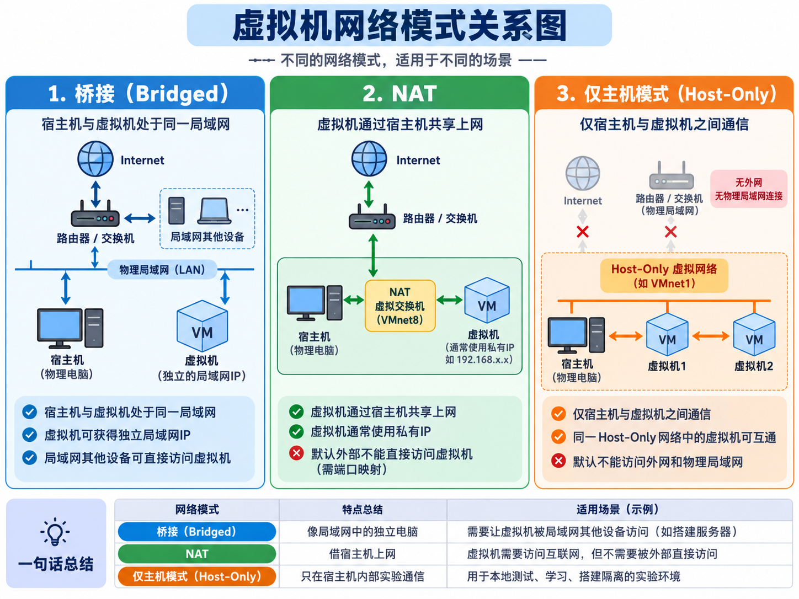
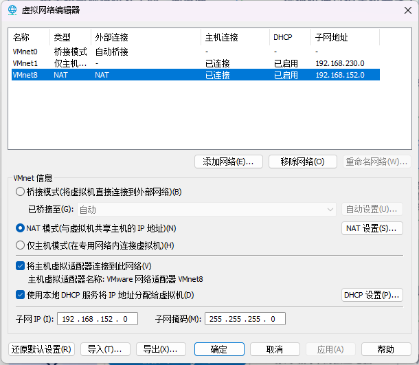
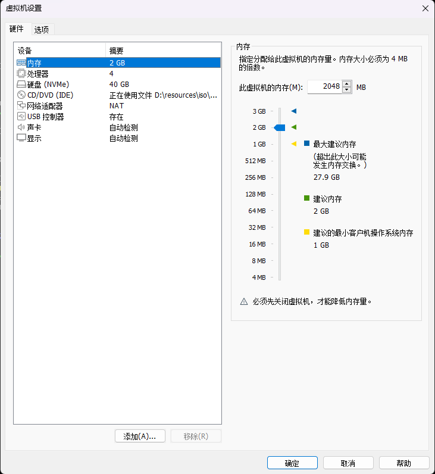

# 模块一：Linux基础运维

> 适用课程：《Linux操作系统》  
> 对应实验：实验1—实验7｜建议学时：20学时
> 主线环境：`rocky-server`、`rocky-web`｜Ubuntu 22.04 Desktop `ubuntu-client`

## 模块导读

Linux是服务器、云计算平台、网络设备、容器平台和自动化运维系统的重要基础。本模块从安装三机环境开始，逐步学习命令行、目录与文件、文本编辑、用户和权限、软件包、服务、日志以及系统资源检查。

完成本模块后，应能够：

1. 说明Linux内核、发行版和应用软件之间的关系。
2. 在VMware中安装`rocky-server`、`rocky-web`和Ubuntu 22.04 Desktop `ubuntu-client`，完成首次登录、基础网络验证和初始快照。
3. 使用命令行完成文件、目录、文本和归档管理。
4. 创建用户和用户组，正确配置文件权限和sudo授权。
5. 使用DNF和APT安装、查询、升级与卸载软件。
6. 使用systemd管理服务，并通过journal日志定位服务问题。
7. 检查CPU、负载、内存、磁盘、进程和监听端口。
8. 按“查看现状—修改配置—验证结果—查看日志—保留回退”的流程完成系统管理任务。

## 学习环境

| 项目 | 建议配置 |
|---|---|
| 宿主机 | Windows 10/11 64位 |
| 虚拟化软件 | VMware Workstation 17 |
| `rocky-server` | 2 vCPU、4GB内存、50GB磁盘、NAT；主机名和用户名均为`rocky-server` |
| `rocky-web` | 2 vCPU、2GB内存、40GB磁盘、NAT；主机名和用户名均为`rocky-web` |
| `ubuntu-client` | 2 vCPU、4GB内存、40GB磁盘、NAT；主机名和用户名均为`ubuntu-client` |
| 教学密码 | 三台机器统一为`123456`，仅用于隔离课堂环境 |
| 终端工具 | VMware控制台；后续可使用Windows Terminal、Xshell或MobaXterm |

实验2—13默认在`rocky-server`操作；实验14切换到`rocky-web`部署Nginx；实验15—19返回`rocky-server`；`ubuntu-client`全程作为浏览器、SSH、curl和数据库客户端。静态IP在实验8统一配置，实验1先让三台虚拟机通过DHCP联网并记录基线。

## 学习路线与成果

本教材保留12章完整知识结构，课堂按7个实验项目组织为20学时。教材用于讲解原理和补充练习，`labs/linux/`中的实验手册规定必做步骤、验证证据和成果提交要求。

| 实验 | 对应教材章节 | 项目重点 | 应形成的成果 |
|:--|---|---|---|
| 实验1（4学时） | 第1—2章 | Linux起源、发行版、VMware和三机安装 | 可运行、可登录、可联网、可回退的三机环境 |
| 实验2（4学时） | 第3—5章相关内容 | 命令行、目录、文件、查看和基础重定向 | 规范的项目目录树和操作记录 |
| 实验3（2学时） | 第5—6章 | 查找、链接、Vim、归档和恢复 | 配置修改、归档及恢复验证 |
| 实验4（4学时） | 第7—9章 | 用户、组、共享权限、umask和最小sudo | 部门账号、共享目录和授权证据 |
| 实验5（2学时） | 第10章 | DNF、RPM、仓库和GPG | 软件安装、查询、卸载与回退记录 |
| 实验6（2学时） | 第11章 | systemd、journal和启动故障 | 状态—日志—根因—修复记录 |
| 实验7（2学时） | 第12章 | CPU、内存、进程、磁盘和容量 | 系统状态与容量巡检表 |

## 本册学习方式

本册按照第1—12章顺序学习。每章先理解对象和原理，再完成本章中的短练习，最后进入对应实验。教材中的短练习用于验证单项知识；实验1—7把多项知识组合成三机环境、账号权限、服务故障和巡检成果。

教材练习默认使用`~/course-practice/m1/chXX`等独立目录。练习会在首次使用前创建所需目录和文件，可以按章节说明清理。`~/m1-project`、`/srv/course-share`、实验账号、软件配置和服务状态属于贯穿项目成果，除非实验明确要求，不得因完成某一章练习而删除。

学习每章时完成下面的闭环：

```text
明确问题 → 阅读必学知识 → 预测命令结果 → 完成短练习
→ 使用命令验证 → 解释错误 → 进入对应实验 → 保存验收证据
```

正文用于建立完整知识体系；标为“拓展”的内容用于查阅，不作为为进入下一实验必须掌握的范围。实验中遇到路径、权限、服务或资源问题时，应返回对应章节按对象关系排查，而不是直接复制其他来源的修复命令。

### 代码块与任务标记

本册代码块分为三类：

| 标记 | 是否执行 | 用途 |
|---|---|---|
| 观察命令 | 可以执行 | 查看系统现状，不依赖课程项目成果 |
| 本章短练习 | 按顺序执行 | 使用`~/course-practice/m1/`中的独立对象，练习单项知识 |
| 实验衔接 | 转入对应实验后执行 | 创建或修改`~/m1-project`、系统账号、`/srv`目录、软件包和需保留的系统服务 |

没有标明“本章短练习”的代码块可能只是语法示例。先预测其作用和结果，再根据上下文决定是否执行，不应把教材中的每个代码块整段粘贴到终端。第11章会创建一个明确标记、完成后立即清理的临时服务；它不属于贯穿项目状态。

### 第1—12章学练顺序

| 章节 | 20—25分钟必学内容 | 本章短练习 | 对应实验 |
|---|---|---|---|
| 第1章 | 操作系统、内核、发行版、Shell与运维闭环 | 写出服务器交付八问 | 实验1任务导入 |
| 第2章 | VMware层次、NAT/桥接/仅主机、VMnet8与快照 | 完成三机资源和网络模式规划 | 实验1 |
| 第3章 | 命令格式、帮助、补全、引号与退出状态 | 查询命令类型并比较成功/失败退出码 | 实验2前半部分 |
| 第4章 | Linux目录树、路径、创建、复制、移动与删除 | 在`ch04`整理一组交付文件 | 实验2 |
| 第5章 | 查看、筛选、find、inode、链接与重定向 | 在`ch05`完成日志查找和链接验证 | 实验3前半部分 |
| 第6章 | Vim模式、配置备份、tar与恢复验证 | 在`ch06`完成配置修改和归档恢复 | 实验3 |
| 第7章 | UID/GID、主组、附加组、账号文件与密码 | 读取身份信息并设计账号矩阵 | 实验4前半部分 |
| 第8章 | 文件/目录rwx、umask、SGID、Sticky bit与ACL | 在个人目录预测并验证权限 | 实验4中段 |
| 第9章 | sudo、绝对命令路径、visudo与最小授权 | 阅读授权需求并写出规则草案 | 实验4后半部分 |
| 第10章 | RPM/DNF、DEB/APT、仓库、签名与回退 | 查询软件来源并预演安装或卸载 | 实验5 |
| 第11章 | 进程、Unit、active/enabled与journal | 创建并排查可清理的临时服务 | 实验6 |
| 第12章 | CPU、负载、内存、进程、磁盘、inode与端口 | 生成只读系统状态摘要 | 实验7 |

## 贯穿项目：新业务服务器基础交付

本模块不是十二组互不相关的命令练习。你将以初级Linux运维工程师身份，完成一台新业务服务器的基础交付。

### 项目背景

星云科技准备上线一个内部应用。网络和应用服务将在后续模块部署，本模块先交付操作系统基础环境。交付结果必须让后续人员知道服务器如何安装、文件放在哪里、谁有权限、软件从哪里安装、服务是否正常以及出现问题时如何回退。

### 贯穿成果

```text
Rocky Linux基础环境（实验8再配置静态地址）
├── ~/m1-project              项目工作区和操作证据
├── /srv/course-share         项目协作与权限验证目录
├── dev01、dev02              开发协作账号
├── auditor                   审计只读账号
├── juniorops                 初级运维受限sudo账号
├── project-dev、project-audit 项目开发组与审计组
├── 软件源与基础软件记录
├── systemd服务操作记录
├── systemd服务操作与日志证据
└── Linux基础环境巡检记录
```

各实验从相关章节选择必要原理和命令。Ubuntu安装属于实验1必做内容，固定IP属于实验8内容，综合交付脚本属于后续实验内容；必做范围以实验1—7手册为准。前文创建的虚拟机、目录、账号和配置会继续使用，不要提前删除。

---

# 第1章 Linux、操作系统与运维岗位

## 1.1 操作系统解决什么问题

一台计算机包含CPU、内存、磁盘、网卡等硬件。应用程序如果直接控制所有硬件，会面临三个问题：

- 每个程序都需要理解不同硬件的控制方式。
- 多个程序可能同时争抢CPU、内存和磁盘。
- 一个程序的错误可能破坏其他程序的数据。

操作系统位于硬件与应用之间，主要负责：

| 职责 | 示例 |
|---|---|
| 处理器管理 | 决定哪些进程获得CPU时间 |
| 内存管理 | 为进程分配、回收并隔离内存 |
| 文件系统 | 用目录和文件组织磁盘数据 |
| 设备管理 | 通过驱动程序管理磁盘、网卡等设备 |
| 用户与权限 | 判断谁可以访问哪些资源 |
| 网络通信 | 提供IP、TCP/UDP、Socket等能力 |
| 服务管理 | 启动、停止并监控后台服务 |

## 1.2 Linux内核与Linux发行版

Linux严格来说是一个操作系统内核。实际安装的Rocky Linux、Ubuntu Desktop并不只有内核，而是由以下部分组成：

```text
Linux发行版
├── Linux内核
├── GNU命令和基础工具
├── Shell
├── 软件包管理器和软件仓库
├── systemd等系统服务
├── 安装程序
└── 发行版维护的配置与安全更新
```

因此，“Linux发行版版本”和“Linux内核版本”不是同一个概念。

查看发行版：

```bash
cat /etc/os-release
```

查看内核：

```bash
uname -r
```

查看CPU架构：

```bash
uname -m
```

常见结果`x86_64`表示64位x86架构。ARM服务器上可能看到`aarch64`。

## 1.3 Rocky Linux与Ubuntu Desktop

| 对比项 | Rocky Linux 9 | Ubuntu 22.04 Desktop LTS |
|---|---|---|
| 发行版家族 | RHEL兼容 | Debian/Ubuntu |
| 软件包格式 | RPM | DEB |
| 高层包管理器 | DNF | APT |
| 底层包工具 | rpm | dpkg |
| 常见服务器场景 | 企业服务器、传统运维环境 | 云平台、开发和服务器环境 |
| 本课程定位 | 主线系统 | 对照系统 |

两者使用相同的Linux基本思想。`cd`、`cp`、`chmod`、`systemctl`等大量命令基本一致，主要差异集中在软件包、部分服务名称、默认配置和文件路径。

## 1.4 Linux系统的基本层次

```text
应用程序
   ↓
Shell / 系统服务 / 运行库
   ↓
系统调用接口
   ↓
Linux内核
   ↓
CPU / 内存 / 磁盘 / 网卡
```

Shell是接收命令并调用程序的命令解释器。Bash是常见Shell之一。Shell不是内核，终端也不是Shell：

- 终端负责输入和显示。
- Shell读取并解释命令。
- 命令程序完成具体工作。
- 内核负责访问硬件和管理资源。

## 1.5 Linux运维工作的基本方法

Linux管理不是“背命令”，而是围绕对象和证据工作：

```text
确认目标
→ 查看当前状态
→ 备份配置或创建快照
→ 修改最小必要内容
→ 检查语法或配置
→ 应用修改
→ 从使用者视角验证
→ 查看日志
→ 记录与复盘
```

## 1.6 云计算运维与网络工程岗位中的Linux

岗位工作通常不是完成一条孤立命令，而是交付一个可使用、可验证、可维护的系统结果：

| 工作对象 | 典型任务 | 可验收结果 |
|---|---|---|
| 操作系统 | 安装、初始化、软件源、时间和主机名 | 系统基线记录、可回退快照 |
| 身份与权限 | 创建账号、划分用户组、最小sudo授权 | 权限矩阵、授权文件、审计日志 |
| 服务 | 安装、配置、启停、自启和故障定位 | 服务状态、端口、功能测试、日志证据 |
| 网络与安全 | 地址、路由、DNS、远程连接和基础防护 | 连通性记录、访问控制与防火墙规则 |
| 自动化 | 批量检查和配置多台主机 | 可重复执行的脚本或自动化任务 |
| 虚拟化与容器 | 创建运行环境、发布应用、保存数据 | 可复现的虚拟机或容器化服务 |

本模块先建立单机Linux管理基础；后续模块继续学习网络与远程管理、基础防护、Nginx等企业服务、虚拟化、多机环境和Docker容器化。大二下册的云计算应用、网络安全基础和企业级综合实训会继续使用本课程形成的主机、网络、服务和排障记录。

### 本章短练习：定义交付标准

此时Linux尚未安装，不执行Linux命令。先写出一台“可交付服务器”至少应回答的八个问题：当前用户是谁、主机名是什么、使用哪个发行版、内核版本是什么、CPU架构和核心数是多少、内存多大、磁盘如何组织、如何回退错误操作。第2章安装完成后将用真实命令填写这些信息。

### 本章检查

1. Linux内核与Rocky Linux发行版是什么关系？
2. Shell、终端和内核分别承担什么职责？
3. 为什么运维操作必须包含验证和回退？

---

# 第2章 VMware虚拟机与Linux安装

## 2.1 为什么使用虚拟机

虚拟机是在软件中模拟出的计算机。每台虚拟机拥有虚拟CPU、内存、磁盘和网卡，可以独立安装操作系统。

```text
Windows宿主机
└── VMware Workstation
    ├── rocky-server（基础运维、数据库与后续KVM）
    ├── rocky-web（Nginx与Web服务）
    └── ubuntu-client（Ubuntu 22.04 Desktop图形客户端）
```

虚拟机适合学习环境的原因：

- 实验与宿主机相互隔离。
- 可以创建快照并快速恢复。
- 可以克隆多台服务器。
- 可以模拟网络和服务器环境。

快照用于短期回退，不等于独立备份。删除或损坏原虚拟机文件后，依赖原磁盘链的快照也可能失效。

## 2.2 VMware三种常用网络模式

虚拟机网卡连接到VMware提供的虚拟交换网络。三种模式解决的问题不同：

| 模式 | VMware常用网络 | 虚拟机能访问宿主机 | 虚拟机能访问外部网络 | 局域网其他主机能否直接访问虚拟机 | 适用场景 |
|:-:|:-:|:--:|:--:|:--:|:-:|
| 桥接 | VMnet0 | 能 | 能 | 通常能 | 虚拟机直接加入真实局域网 |
| NAT | VMnet8 | 能 | 能，由宿主机转换地址 | 默认不能主动进入 | 稳定的课程实验网络 |
| 仅主机 | VMnet1 | 能 | 默认不能 | 默认不能 | 完全隔离或只与宿主机通信 |

表中的“能”以地址、路由和防火墙允许为前提，不表示任何端口天然开放。

### 桥接模式

桥接后，虚拟机像一台真实电脑接入宿主机所在局域网，通常从校园网或路由器获得地址。它受真实网络的DHCP、认证、无线网卡限制和地址策略影响。同学连接不同网络时，地址可能变化，部分校园网还会限制新增终端，因此不作为本课程默认模式。

### NAT模式

NAT模式把虚拟机放入VMnet8私有网络。虚拟机之间可以通信，也可以经宿主机访问外部网络；外部局域网默认不能直接向虚拟机发起连接。实验1先使用DHCP确认环境可用，实验8再根据教师提供的实际网段配置固定地址。

### 仅主机模式

仅主机模式通常使用VMnet1。虚拟机可以与宿主机及同一VMnet1中的虚拟机通信，但默认没有通向外部网络的NAT网关，适合恶意代码分析或隔离网络实验。本课程后续虚拟化模块会再次比较这些模式。

## 2.3 识别VMnet8实验网络

VMnet8的实际网段可能因机房、安装时间和已有配置而不同，因此教材中的`192.168.200.0/24`只能作为后续章节的讲解示例，不能在实验1直接照抄。

```text
校园网或互联网
      │
Windows宿主机物理网卡
      │ NAT地址转换
VMware VMnet8（实际网段以本机为准）
├── 宿主机虚拟网卡
├── NAT网关
└── Rocky Linux DHCP地址
```

在VMware Workstation中打开“编辑 → 虚拟网络编辑器”，查看并记录VMnet8的子网、掩码、NAT网关和DHCP范围。实验1以查看为主，不随意修改公共机房的虚拟网络配置。Windows执行`ipconfig`，核对VMware Network Adapter VMnet8的实际地址。

到实验8时，教师统一公布网段、网关、DNS和每位学生的静态地址，学生再完成持久配置与回退验证。

> 

交互观察：打开[VMware三种网络模式与课程三机拓扑动画](../animations/01-vmware-network-modes/index.html)，依次切换NAT、桥接和仅主机模式，观察同网段通信、外网访问和外部主动访问的路径。动画中的地址只用于说明关系，实验1仍应记录本机实际VMnet8参数。

> ****

## 2.4 创建Rocky Linux虚拟机

推荐配置：

| 配置项 | 建议值 |
|---|---|
| 虚拟机名称 | 第一台`rocky-server`，第二台`rocky-web` |
| 客户机类型 | Linux / RHEL 9 64-bit |
| vCPU | 2 |
| 内存 | 2-4GB |
| 磁盘 | 40GB，单个虚拟磁盘文件 |
| 网络 | NAT，对应VMnet8 |
| ISO | Rocky Linux 9 Minimal ISO |

> 

虚拟磁盘只是宿主机中的文件。安装程序中的分区操作只应作用于本实验虚拟磁盘，不会修改Windows真实磁盘，但仍须核对虚拟机名称、磁盘容量和安装目标。

## 2.5 安装两台Rocky Linux 9并完成初始联网

从ISO启动后完成以下配置：

1. 选择语言和键盘。
2. 选择40GB实验磁盘。推荐使用自动LVM并让根文件系统获得主要空间；若使用自定义分区，`/boot`约1GiB、swap约2GiB，其余主要分配给`/`，根文件系统不得小于30GiB。不要在小容量实验盘中把`/home`单独分走大量空间，因为后续Docker数据默认位于根文件系统下的`/var/lib/docker`。
3. 软件选择使用Minimal Install（最小化安装、无图形桌面）。
4. 打开“Network & Host Name”并启用网卡；第一台主机名设置为`rocky-server`，第二台设置为`rocky-web`。
5. 保持IPv4自动获取（DHCP），打开网卡并确认安装界面显示已连接。
6. 记录安装阶段获得的地址；此地址可能变化，不把它写成全班统一固定值。
7. 设置root密码。
8. 第一台创建普通用户`rocky-server`，第二台创建普通用户`rocky-web`；密码均为`123456`并授予管理员权限。
9. 开始安装，完成后重启并断开ISO。

> **[截图占位 M1-04：Rocky安装器中网卡已启用并通过DHCP获得地址]**

> **[截图占位 M1-05：两台Rocky安装摘要、角色主机名和同名管理员账号]**
第一次登录后检查：

```bash
cat /etc/rocky-release
hostnamectl
ip -br addr
ip route
cat /etc/resolv.conf
df -h
```

将结果填入服务器基线表：

| 项目 | 当前值 |
|---|---|
| 当前用户 | |
| 主机名 | |
| 发行版 | |
| 内核版本 | |
| CPU架构与核心数 | |
| 总内存 | |
| 根文件系统容量 | |
| 默认网关 | |

预期应同时看到Rocky获得一个与实际VMnet8相符的IPv4地址、存在默认路由并具有可用DNS。具体数值因宿主机环境而异。

安装器已经创建NetworkManager自动连接，不需要在实验1额外创建静态连接。查看实际网卡和连接名：

```bash
nmcli device status
nmcli connection show --active
NAT_GATEWAY=$(ip route show default | awk 'NR==1 {print $3}')
ping -c 3 "$NAT_GATEWAY"
```

如果没有地址，先检查VMware虚拟网卡是否连接到NAT、安装器是否启用了网卡，再检查NetworkManager连接。静态IP、网关和DNS的修改方法在实验8集中学习，避免第一次课同时承担安装和网络规划两项高风险操作。

### 配置可用的软件源

机房不能稳定访问默认国外仓库，因此在安装其他工具前先切换到已验证的国内镜像。以下以阿里云Rocky镜像为例：

```bash
# 1. 备份原有源配置文件（防止误操作）
sudo cp -r /etc/yum.repos.d /etc/yum.repos.d.backup

# 2. 使用 sed 命令替换仓库地址为阿里云
sudo sed -e 's|^mirrorlist=|#mirrorlist=|g' \
         -e 's|^#baseurl=http://dl.rockylinux.org/$contentdir|baseurl=https://mirrors.aliyun.com/rockylinux|g' \
         -i.bak \
         /etc/yum.repos.d/rocky*.repo

# 3. 清理旧缓存并生成新缓存
sudo dnf clean all
sudo dnf makecache
```

`makecache`失败时不要继续安装。先查看错误并检查IP、默认路由、DNS和系统时间；若确认镜像配置不适用，读取刚才保存的路径并恢复：

```bash
ROCKY_REPO_BACKUP=$(cat /var/tmp/course-rocky-repo-backup.path)
sudo cp -a "$ROCKY_REPO_BACKUP"/. /etc/yum.repos.d/
sudo dnf clean all
sudo dnf makecache
```

如果课程统一使用清华镜像，应使用开课前已经实机验证的Rocky 9仓库配置。不能使用CentOS 7、Rocky 8或其他大版本的repo文件。

安装VMware Tools：

```bash
sudo dnf install -y open-vm-tools openssh-server chrony
sudo systemctl enable --now vmtoolsd
sudo systemctl enable --now sshd
sudo systemctl enable --now chronyd
systemctl status vmtoolsd --no-pager
```

创建快照前关机：

```bash
sudo systemctl poweroff
```

快照分别命名为`00-rocky-server-安装与基础工具完成`和`00-rocky-web-安装与基础工具完成`。

快照完成后重新启动两台Rocky并核对身份，然后安装Ubuntu图形客户端。

## 2.6 安装Ubuntu 22.04 Desktop客户端

Ubuntu Desktop使用图形安装程序。核心步骤：

1. 使用`ubuntu-22.04.x-desktop-amd64.iso`启动。
2. 选择语言和键盘。
3. 网络暂时保持安装程序自动获取地址（DHCP），确认网卡能够取得与VMnet8实际网段一致的IPv4地址。不要在实验1照抄固定地址；Ubuntu Desktop的NetworkManager静态连接在实验8统一完成。
4. 使用整个40GB虚拟磁盘完成正常的Ubuntu Desktop安装。
5. 计算机名、主机名和用户名均设置为`ubuntu-client`，密码为`123456`，不启用自动登录。
6. 完成安装并重启，进入图形桌面后打开Terminal。
7. 使用APT安装`open-vm-tools-desktop`、OpenSSH和curl等客户端工具。

> **[截图占位 M1-06：Ubuntu Desktop图形桌面、Terminal、DHCP地址和主机名]**

登录后执行：

```bash
. /etc/os-release
printf 'version=%s codename=%s arch=%s\n' \
  "$VERSION_ID" "$VERSION_CODENAME" "$(dpkg --print-architecture)"
```

只有结果为Ubuntu `22.04`、代号`jammy`且架构为`amd64`时，才使用下面的课程配置。先备份，再切换到开课前已验证的阿里云镜像：

```bash
UBUNTU_SOURCE_BACKUP="/etc/apt/sources.list.before-course.$(date +%F-%H%M%S)"
sudo cp -a /etc/apt/sources.list "$UBUNTU_SOURCE_BACKUP"
printf '%s\n' "$UBUNTU_SOURCE_BACKUP" | \
  sudo tee /var/tmp/course-ubuntu-source-backup.path

sudo tee /etc/apt/sources.list >/dev/null <<'EOF'
deb https://mirrors.aliyun.com/ubuntu/ jammy main restricted universe multiverse
deb https://mirrors.aliyun.com/ubuntu/ jammy-updates main restricted universe multiverse
deb https://mirrors.aliyun.com/ubuntu/ jammy-backports main restricted universe multiverse
deb https://mirrors.aliyun.com/ubuntu/ jammy-security main restricted universe multiverse
EOF

sudo apt clean
sudo apt update
sudo apt install -y open-vm-tools open-vm-tools-desktop openssh-server curl
sudo systemctl enable --now ssh
cat /etc/os-release
ip -br addr
ip route
```

Ubuntu 22.04 Desktop的软件源通常配置在`/etc/apt/sources.list`。不要直接复制其他发行版或其他Ubuntu版本的软件源配置。`apt update`失败时先排查网络、DNS、时间和镜像地址；需要回退时读取`/var/tmp/course-ubuntu-source-backup.path`中记录的实际文件名并恢复。

## 2.7 三机基础连通性验证

分别用`ip -br addr`记录三台机器的DHCP地址。网关可从默认路由自动取得；在`ubuntu-client`通过提示输入两台Rocky的实际地址：

两台Rocky分别测试网关；`ubuntu-client`测试两台服务器：

```bash
VMNET8_GATEWAY=$(ip route show default | awk 'NR==1 {print $3}')
ping -c 3 "$VMNET8_GATEWAY"

# ubuntu-client继续执行
read -r -p 'rocky-server当前IPv4地址：' ROCKY_SERVER_IP
read -r -p 'rocky-web当前IPv4地址：' ROCKY_WEB_IP
ping -c 3 "$ROCKY_SERVER_IP"
ping -c 3 "$ROCKY_WEB_IP"
```

Windows宿主机执行：

```powershell
$RockyServerIp = Read-Host '请输入rocky-server当前IPv4地址'
$RockyWebIp = Read-Host '请输入rocky-web当前IPv4地址'
$UbuntuClientIp = Read-Host '请输入ubuntu-client当前IPv4地址'

ping rocky-server当前IPv4地址
ping $RockyWebIp
ping $UbuntuClientIp
```

验证顺序是“本机地址→NAT网关→同一VMnet8中的其他虚拟机”，不要一开始只测试互联网地址。实验8会为三台虚拟机配置稳定静态地址和hosts解析。

## 2.8 安装故障排查

| 现象 | 检查方向 |
|---|---|
| 虚拟机无法启动64位系统 | BIOS/UEFI是否开启VT-x/AMD-V |
| 启动后找不到安装程序 | ISO是否正确挂载、启动顺序是否正确 |
| 重启后再次进入安装界面 | ISO未断开或光驱优先启动 |
| 安装时没有网络 | VMware网卡是否Connected、是否连接VMnet8 |
| 系统启动后无IP | 安装器静态配置、`ip link`、`nmcli device` |
| 能ping自己但不能ping网关 | VMnet8子网、网关、掩码或虚拟网卡连接错误 |
| 任意两台虚拟机地址相同 | 立即关闭冲突机器并在实验8统一修正 |
| 系统时间错误 | 时区、宿主机时间、时间同步服务 |

### 本章短练习：完成三机规划表

安装前先完成规划，避免边点击安装器边临时决定资源和网络。将以下内容记录到纸面或课程记录中：

| 项目 | rocky-server | rocky-web | ubuntu-client |
|---|---|---|---|
| 操作系统版本 | Rocky Linux 9 | Rocky Linux 9 | Ubuntu 22.04 Desktop |
| 主机名 |  |  |  |
| VMware网络 |  |  |  |
| vCPU/内存/磁盘 |  |  |  |
| 初始地址来源 |  |  |  |
| 主要用途 |  |  |  |

同时记录VMnet8实际子网、掩码、网关和DHCP范围。地址不能照抄教材示例，规划中的静态地址必须避开网关和DHCP动态分配区；本章只规划，实验8才正式配置固定地址。

### 实验衔接：实验1验收

- [ ] Rocky Linux 9可以使用普通用户登录。
- [ ] `rocky-server`和`rocky-web`分别能使用同名普通用户登录并使用sudo。
- [ ] 已记录VMnet8的实际子网、网关和DHCP范围，没有照抄示例地址。
- [ ] Rocky通过DHCP获得IPv4地址，默认路由和名称解析可用。
- [ ] `open-vm-tools`处于active状态。
- [ ] 已创建干净快照。

- [ ] Ubuntu 22.04 Desktop客户端能够使用`ubuntu-client`登录、打开Terminal并使用sudo。
- [ ] `ubuntu-client`通过DHCP联网，已创建安装完成快照。
- [ ] 三台虚拟机地址不重复，能够访问NAT网关；三机固定地址和互通在实验8完成。

---

# 第3章 命令行基础与双发行版对照

## 3.1 理解Shell提示符

常见提示符：

```text
[rocky-server@rocky-server ~]$
[root@rocky-server ~]#
```

- 第一个`rocky-server`是当前用户。
- 第二个`rocky-server`是主机名。
- `~`代表当前用户家目录。
- `$`通常表示普通用户。
- `#`通常表示root用户。

不要把教材代码块前的说明文字复制到终端。命令中的`$`和`#`如果只是提示符，也不属于命令本身。

## 3.2 命令的基本格式

```text
命令 [选项] [参数对象]
```

例如：

```bash
ls -l /etc
```

- 命令：`ls`
- 选项：`-l`
- 参数：`/etc`

Linux命令和文件名通常区分大小写。`File.txt`与`file.txt`是两个不同名称。

## 3.3 获取帮助

```text
command --help
man command
type command
which command
```

这里的`command`表示需要查询的真实命令名，不是要求输入的固定单词。下面使用`ls`、`cd`等真实对象练习。

示例：

```bash
ls --help | less
man ls
type cd
type ls
which ls
```

`cd`通常是Shell内建命令，因此`which cd`可能找不到；`type cd`能说明它是Shell builtin。

Minimal安装若没有`man`：

```bash
sudo dnf install -y man-db man-pages
```

## 3.4 常用入门命令

```bash
pwd                  # 当前目录
ls                   # 列出目录内容
ls -lah              # 长格式、含隐藏文件、易读大小
cd /etc              # 进入目录
cd ..                # 返回上一级
cd ~                 # 回到家目录
clear                # 清屏
whoami               # 当前用户名
hostname             # 主机名
date                  # 日期时间
```

## 3.5 历史、补全和快捷键

| 操作 | 功能 |
|---|---|
| `history` | 查看命令历史 |
| `!!` | 再次执行上一条命令，使用前先确认 |
| `Ctrl+R` | 反向搜索历史 |
| `Tab` | 补全命令或路径 |
| `Ctrl+C` | 中断当前前台命令 |
| `Ctrl+L` | 清屏 |
| `Ctrl+A` / `Ctrl+E` | 移到行首/行尾 |

历史命令可能包含密码或敏感参数，不应把密码直接写在命令行中。

## 3.6 引号与Shell展开

```bash
name=Rocky
echo "$name Linux"       # 双引号：变量会展开
echo '$name Linux'       # 单引号：原样输出
echo file{1..3}.txt      # 花括号展开
touch file{1..3}.txt     # 创建file1.txt file2.txt file3.txt
echo *.txt               # 通配符展开
```

包含空格的路径需要引用：

```bash
mkdir -p "$HOME/My Project"
cd "$HOME/My Project"
pwd
cd ~
```

## 3.7 退出状态

程序结束时会返回退出状态。通常0表示成功，非0表示失败：

```bash
ls /etc/passwd
echo $?

ls /path/not-exist
echo $?
```

“没有输出”不等于成功，“有输出”也不等于失败。脚本和自动化工具主要依赖退出状态判断结果。

## 3.8 Rocky与Ubuntu常见命令对照

| 任务 | Rocky Linux 9 | Ubuntu 22.04 Desktop |
|---|---|---|
| 更新软件索引 | `dnf makecache` | `apt update` |
| 安装软件 | `dnf install 包名` | `apt install 包名` |
| 查询软件 | `dnf search 关键词` | `apt search 关键词` |
| 查询已安装包 | `rpm -q 包名` | `dpkg -l 包名` |
| 防火墙 | firewalld | ufw常见，也可使用nftables |
| 网络管理 | NetworkManager/nmcli | netplan/systemd-networkd常见 |

### 本章短练习：查询命令并验证退出状态

在Rocky和Ubuntu中分别创建本章独立记录目录，然后按顺序执行：

```bash
mkdir -p ~/course-practice/m1/ch03
{
    printf '=== system ===\n'
    grep -E '^(NAME|VERSION_ID)=' /etc/os-release
    printf '\n=== command types ===\n'
    type cd
    type ls
    type echo
    printf '\n=== successful command ===\n'
    ls /etc/passwd
    printf 'success_exit_code=%s\n' "$?"
    printf '\n=== failed command ===\n'
    ls /path/not-exist
    printf 'failure_exit_code=%s\n' "$?"
} > ~/course-practice/m1/ch03/command-basics.txt 2>&1
```

继续完成两个不写入记录文件的交互任务：使用`man ls`找到按修改时间排序的选项；使用Tab补全进入`/etc/systemd/system`，再回到家目录。不要直接照抄完整路径来代替补全练习。

### 验收标准

- [ ] 能解释命令、选项和参数。
- [ ] 会使用`--help`、`man`、`type`和历史搜索。
- [ ] 能正确解释`$?`。
- [ ] 能说出DNF与APT的基本对应关系。
- [ ] `command-basics.txt`中成功命令退出码为0、失败命令退出码非0。

### 实验衔接：实验2前半部分

实验2会从命令解释和帮助查询转入真实文件目录工单。正式项目目录由实验2根据业务任务创建，不复制本章`ch03`记录目录。

---

# 第4章 Linux目录结构与文件管理

## 4.1 单根目录树

Windows常用`C:\`、`D:\`区分不同驱动器。Linux从一个根目录`/`开始组织所有文件系统：

```text
/
├── bin -> usr/bin
├── sbin -> usr/sbin
├── lib -> usr/lib
├── lib64 -> usr/lib64
├── boot
├── dev
├── etc
├── home
├── media
├── mnt
├── opt
├── proc
├── root
├── run
├── srv
├── sys
├── tmp
├── usr
└── var
```

| 目录 | 主要用途 |
|---|---|
| `/bin` | 基本用户命令；现代Rocky和Ubuntu通常链接到`/usr/bin` |
| `/sbin` | 系统管理命令；现代系统通常链接到`/usr/sbin` |
| `/lib`、`/lib64` | 基础共享库和动态链接器；通常链接到`/usr/lib*` |
| `/etc` | 系统和服务配置 |
| `/home` | 普通用户家目录 |
| `/root` | root用户家目录 |
| `/usr` | 用户空间程序、库、文档和共享只读数据 |
| `/usr/bin` | 大量普通命令，如`ls`、`cp` |
| `/usr/sbin` | 大量系统管理命令 |
| `/usr/local` | 本机自行安装的软件和脚本，避免被发行版包覆盖 |
| `/var` | 日志、缓存、数据库等变化数据 |
| `/var/log` | 系统与服务日志 |
| `/tmp` | 临时文件，可能被定期清理 |
| `/boot` | 引导加载器、内核和启动文件 |
| `/dev` | 设备文件 |
| `/proc` | 进程和内核运行信息的虚拟视图 |
| `/sys` | 设备和内核对象的虚拟视图 |
| `/run` | 本次启动期间的运行时数据 |
| `/opt` | 可选的第三方应用 |
| `/srv` | 服务对外提供的数据 |
| `/mnt` | 管理员临时挂载文件系统 |
| `/media` | U盘、光盘等可移动介质的挂载位置 |

### 为什么/bin会指向/usr/bin

早期Unix和Linux把系统启动所需的基本命令放在`/bin`，把其他命令放在`/usr/bin`。现代发行版普遍采用usr-merge，把程序和库集中到`/usr`，同时保留旧路径作为符号链接，兼容仍然使用`/bin/ls`等路径的脚本。

在Rocky和Ubuntu分别验证。先观察这些路径本身：

```bash
ls -ld /bin /sbin /lib /lib64
```

如果Ubuntu提示`/lib64`不存在，只记录现象，不需要创建它。再逐条查看链接最终指向哪里：

```bash
readlink -f /bin
```

```bash
readlink -f /sbin
```

```bash
readlink -f /bin/ls
```

最后确认直接输入`ls`时会执行哪个程序：

```bash
command -v ls
```

因此`/bin`并没有消失。输入`/bin/ls`时，系统最终通常执行`/usr/bin/ls`。不同CPU架构的库目录名称可能不同，不能假设所有系统都一定存在`/lib64`。

交互观察：打开[Linux目录树、路径与链接动画](../animations/02-linux-filesystem-paths-links/index.html)，先完成“目录树与/bin”和“绝对/相对路径”两个主题。每一步先根据当前目录预测目标，再到Rocky中使用`pwd`、`ls -ld`和`readlink -f`验证。

### 磁盘目录和虚拟目录

`/etc`、`/home`和`/var`等内容通常保存在磁盘文件系统中；`/proc`和`/sys`主要由内核动态提供，不是普通磁盘数据。`/dev`中的设备文件也不是设备内容本身，而是访问设备的接口。

不要把所有个人文件都放到`/root`或`/tmp`。配置、程序、数据和日志应放在职责明确的位置。

## 4.2 绝对路径与相对路径

- 绝对路径从`/`开始，例如`/etc/ssh/sshd_config`。
- 相对路径从当前目录开始，例如`docs/report.md`。

特殊路径：

| 表示 | 含义 |
|---|---|
| `.` | 当前目录 |
| `..` | 上一级目录 |
| `~` | 当前用户家目录 |
| `-` | `cd`中代表上一次目录 |

先显示当前目录：

```bash
pwd
```

使用绝对路径进入日志目录：

```bash
cd /var/log
```

确认当前位置：

```bash
pwd
```

使用相对路径回到上一级：

```bash
cd ..
```

再次确认当前位置，然后返回家目录：

```bash
pwd
```

```bash
cd ~
```

```bash
pwd
```

`cd -`会返回上一次所在目录。执行前先预测结果：

```bash
cd -
```

## 4.3 创建文件和目录

本章先在独立练习目录中操作。业务部门交来了一组待整理文件，要求运维人员建立工作区、保留原始文件并形成清晰的交付目录。实验2会使用新的业务数据建立正式项目`~/m1-project`。

| 目录 | 用途 |
|---|---|
| `incoming` | 接收的原始文件，只做必要清理 |
| `config` | 当前使用的配置文件 |
| `data` | 项目数据和清单 |
| `logs` | 操作或应用日志 |
| `scripts` | 运维脚本 |
| `backup` | 初始配置和归档 |
| `docs` | 说明、证据和交付文档 |

### 本章短练习：准备交付文件

练习目录固定为`~/course-practice/m1/ch04`。本节按照“执行一条、观察一次”的顺序准备对象。

第一步，创建多级练习目录：

```bash
mkdir -p ~/course-practice/m1/ch04
```

`-p`表示缺少的父目录也一并创建；目录已经存在时，不会仅因这一点报错。

第二步，进入练习目录：

```bash
cd ~/course-practice/m1/ch04
```

立即确认当前位置。后续命令使用相对路径，避免反复输入很长的绝对路径：

```bash
pwd
```

第三步，逐个创建业务目录。每执行一条命令，就观察一次：

```bash
mkdir incoming
```

```bash
ls -ld incoming
```

```bash
mkdir config
```

```bash
mkdir data
```

```bash
mkdir logs
```

```bash
mkdir scripts
```

```bash
mkdir backup
```

```bash
mkdir docs
```

熟悉`mkdir`后，可以用一条`ls`同时检查这些目录：

```bash
ls -ld incoming config data logs scripts backup docs
```

第四步，创建一份空的目录规划文档：

```bash
touch docs/directory-plan.md
```

用`ls -l`确认对象类型和文件名：

```bash
ls -l docs/directory-plan.md
```

第五步，模拟业务部门交来的原始文件。这里暂时使用`echo 内容 > 文件`生成简短素材；`>`表示把输出写入文件，后续章节会专门学习重定向。

```bash
echo 'app_name=internal-demo' > incoming/app.conf.sample
```

```bash
echo 'rocky-server,data-and-ops,待实验8确定' > incoming/server-list.csv
```

```bash
echo '该文件为过期临时说明，确认后删除。' > incoming/obsolete-note.tmp
```

```bash
echo 'INFO service preparation started' > logs/app.log
```

`scripts`目录目前保持为空。第3.6章“Shell服务器巡检”才会正式编写脚本。

第六步，逐个确认后续任务需要的对象确实存在：

```bash
ls -l incoming/app.conf.sample
```

```bash
ls -l incoming/server-list.csv
```

```bash
ls -l incoming/obsolete-note.tmp
```

```bash
ls -l logs/app.log
```

最后查看两层目录结构：

```bash
find . -maxdepth 2 -print
```

只有`incoming`中的三个输入文件和`logs/app.log`都存在，才继续4.4节。

## 4.4 复制、移动和删除

```text
cp 源路径 目标路径
mv 源路径 目标路径
rm 文件路径
```

上面三行是命令格式，中文占位符不是要直接执行的文件名。`cp`保留源对象，`mv`移动或重命名后原路径消失，`rm`删除对象且不经过通用回收站。

重要选项：

| 命令 | 选项 | 作用 |
|---|---|---|
| `cp` | `-a` | 尽量保留属性并递归复制 |
| `cp` | `-i` | 覆盖前询问 |
| `mv` | `-i` | 覆盖前询问 |
| `rm` | `-i` | 删除前询问 |
| `rm` | `-r` | 递归删除目录 |

`rm`没有通用回收站。执行递归删除前应完成三项检查：

```text
pwd
ls -ld 待删除路径
find 待删除路径 -maxdepth 2 -print
```

“待删除路径”是占位说明，必须替换为经过确认的真实路径。

不要在不理解路径展开结果时使用`rm -rf`。

### 练习工单：整理业务部门交付文件

业务要求如下：

1. 原始配置样例必须保留在`incoming`。
2. 将配置样例复制为正式文件`config/app.conf`。
3. 在修改正式配置前，将其初始版本备份为`backup/app.conf.initial`。
4. 服务器清单属于交付文档，应移动到`docs/server-list.csv`。
5. 查看`obsolete-note.tmp`内容，确认确实过期后再删除。
6. 操作完成后，不能出现误删除的目录或额外副本。

先根据需求判断每一步使用`cp`、`mv`还是`rm`，再按下面的顺序逐条完成。

开始前确认仍位于本章练习目录：

```bash
pwd
```

预期路径以`/course-practice/m1/ch04`结尾。

第一步，复制配置样例，保留原文件：

```bash
cp incoming/app.conf.sample config/app.conf
```

观察源文件和副本是否同时存在：

```bash
ls -l incoming/app.conf.sample config/app.conf
```

第二步，备份正式配置：

```bash
cp config/app.conf backup/app.conf.initial
```

确认备份已经产生：

```bash
ls -l backup/app.conf.initial
```

第三步，把服务器清单移动到交付文档目录：

```bash
mv incoming/server-list.csv docs/server-list.csv
```

先检查新位置：

```bash
ls -l docs/server-list.csv
```

再检查原位置。下面这条命令应提示文件不存在，这正是移动成功的证据：

```bash
ls -l incoming/server-list.csv
```

第四步，删除前先查看临时说明：

```bash
cat incoming/obsolete-note.tmp
```

确认内容确实过期后，使用交互确认方式删除：

```bash
rm -i incoming/obsolete-note.tmp
```

输入`y`确认，再检查它已经不存在：

```bash
ls -l incoming/obsolete-note.tmp
```

这里出现`No such file or directory`是预期结果，因为目标已经被删除。

第五步，逐项查看最终对象：

```bash
ls -l incoming/app.conf.sample
```

```bash
ls -l config/app.conf
```

```bash
ls -l backup/app.conf.initial
```

```bash
ls -l docs/server-list.csv
```

## 4.5 隐藏文件和通配符

以`.`开头的名称通常不会被普通`ls`显示。回到练习目录并创建隐藏文件：

```bash
cd ~/course-practice/m1/ch04
```

```bash
touch .practice-meta
```

普通`ls`不会显示它：

```bash
ls
```

加入`-a`后可以看到：

```bash
ls -la
```

常用通配符：

| 通配符 | 含义 | 示例 |
|---|---|---|
| `*` | 任意长度字符 | `*.log` |
| `?` | 任意一个字符 | `file?.txt` |
| `[abc]` | 指定集合中的一个字符 | `file[123].txt` |
| `[0-9]` | 指定范围中的一个字符 | `log[0-9]` |

通配符由Shell展开后再交给命令。先用`printf '%s\n' pattern`或`ls`确认匹配结果，再执行批量复制或删除。

在`logs`目录创建三份空白练习文件：

```bash
touch logs/app-1.log
```

```bash
touch logs/app-2.log
```

```bash
touch logs/readme.txt
```

创建日志备份目录：

```bash
mkdir -p backup/logs
```

复制前先显示`*.log`实际匹配的对象：

```bash
ls -l logs/*.log
```

确认结果中没有`readme.txt`，再执行复制：

```bash
cp logs/*.log backup/logs/
```

检查目标目录：

```bash
ls -l backup/logs
```

`readme.txt`不匹配`*.log`，因此不会被复制。

## 4.6 文件类型

`ls -l`的第一个字符可以初步表示对象类型：

```bash
ls -l config/app.conf
```

`file`根据文件内容和特征判断类型：

```bash
file /bin/ls
```

```bash
file config/app.conf
```

`stat`显示inode、大小、权限和时间等详细元数据：

```bash
stat /etc/passwd
```

```bash
stat config/app.conf
```

`ls -l`首字符常见含义：

| 字符 | 类型 |
|---|---|
| `-` | 普通文件 |
| `d` | 目录 |
| `l` | 符号链接 |
| `c` | 字符设备 |
| `b` | 块设备 |
| `s` | Socket |
| `p` | 命名管道 |

### 本章练习验收

最终目录至少应包含：

```text
ch04
├── .practice-meta
├── backup/app.conf.initial
├── backup/logs/
├── config/app.conf
├── docs/directory-plan.md
├── docs/server-list.csv
├── incoming/app.conf.sample
├── logs/app.log
├── logs/app-1.log
├── logs/app-2.log
├── logs/readme.txt
└── scripts/
```

执行验收前先回到练习目录：

```bash
cd ~/course-practice/m1/ch04
```

查看目录和文件：

```bash
find . -maxdepth 3 -print
```

分别核对配置副本和备份内容：

```bash
cat config/app.conf
```

```bash
cat backup/app.conf.initial
```

`docs/directory-plan.md`已经作为待编写练习文档创建。用自己的语言补充各目录用途，并解释为什么原始配置、正式配置和备份配置不能只保留一份。

### 实验衔接：实验2

进入实验2后，不复制本练习目录。根据实验2的新业务工单，从空白状态建立`~/m1-project`并保存正式成果。这里练习的是单项文件操作，实验2验收的是能否根据业务要求独立组织文件。

---

# 第5章 文件查看、查找与链接

### 操作素材准备

本章使用独立目录并一次性创建日志、文档和链接练习所需的输入：

```bash
mkdir -p ~/course-practice/m1/ch05/{logs,docs,data/link-lab}
cat > ~/course-practice/m1/ch05/logs/app.log <<'EOF'
2026-07-05 09:00:01 INFO service preparation started
2026-07-05 09:00:03 WARN configuration not deployed
2026-07-05 09:00:05 ERROR sample connection failed
2026-07-05 09:00:08 INFO waiting for operator
EOF
```

验证输入存在：

```bash
test -s ~/course-practice/m1/ch05/logs/app.log
echo "log_check=$?"
```

只有`log_check=0`时才继续。

## 5.1 查看文本文件

```bash
cat /etc/os-release
cat ~/course-practice/m1/ch05/logs/app.log
less ~/course-practice/m1/ch05/logs/app.log
head -n 20 /etc/passwd
tail -n 3 ~/course-practice/m1/ch05/logs/app.log
tail -f ~/course-practice/m1/ch05/logs/app.log
```

`tail -f`会持续等待新内容，按`Ctrl+C`结束。Rocky系统若存在`/var/log/messages`，通常需要使用`sudo less /var/log/messages`或`sudo tail /var/log/messages`读取；部分最小化环境主要使用systemd journal，第11章将专门练习。

适用场景：

| 命令 | 适合场景 |
|---|---|
| `cat` | 较短文件一次输出 |
| `less` | 分页查看较长文件，可搜索 |
| `head` | 查看开头 |
| `tail` | 查看结尾或跟踪日志 |

在`less`中：

- `/error`搜索error。
- `n`跳到下一个结果。
- `g`到开头，`G`到结尾。
- `q`退出。

## 5.2 筛选、统计与排序

`grep`按内容筛选行，`wc`统计数量，`sort`排序，`uniq`处理相邻重复行，`cut`按字段提取内容：

```bash
grep 'bash$' /etc/passwd
grep -n -i 'error' ~/course-practice/m1/ch05/logs/app.log
wc -l /etc/passwd
cut -d: -f7 /etc/passwd
cut -d: -f7 /etc/passwd | sort | uniq -c | sort -nr
```

| 命令或选项 | 含义 |
|---|---|
| `grep PATTERN FILE` | 输出匹配模式的行 |
| `grep -n` | 显示行号 |
| `grep -i` | 忽略大小写 |
| `grep -v` | 输出不匹配的行 |
| `wc -l` | 统计行数 |
| `sort` | 按行排序，使相同内容相邻 |
| `uniq -c` | 对相邻重复行计数，通常先配合`sort` |
| `sort -nr` | 按数字倒序排列 |
| `cut -d: -f7` | 以冒号分隔并提取第7字段 |

正则表达式中的`$`表示行尾，因此`grep 'bash$' /etc/passwd`匹配以`bash`结尾的账号记录。模式应使用单引号，避免Shell提前解释特殊字符。

## 5.3 使用find查找

```bash
find /etc -name '*.conf'
find /var/log -type f
find /var -type f -size +100M 2>/dev/null
find /tmp -type f -mtime -1
find ~/course-practice/m1/ch05 -maxdepth 2 -print
```

常用条件：

| 条件 | 含义 |
|---|---|
| `-name` | 按名称，区分大小写 |
| `-iname` | 按名称，不区分大小写 |
| `-type f/d/l` | 文件/目录/链接 |
| `-size +100M` | 大于100MiB |
| `-mtime -1` | 24小时内修改 |
| `-user USER` | 指定所有者 |
| `-maxdepth N` | 限制递归深度 |

对查找结果执行操作前先打印确认。相比拼接字符串，`-exec`能够更安全地处理空格：

```bash
find ~/course-practice/m1/ch05 -type f -name '*.log' -exec ls -lh {} \;
```

## 5.4 查找命令位置

```bash
type ls
command -v ls
which ls
whereis ls
```

- `type`能识别别名、函数、内建命令和外部命令。
- `command -v`适合脚本检查命令是否存在。
- `whereis`可能同时显示程序、源码和手册位置。

## 5.5 inode与链接

文件名是目录中的记录，inode保存文件类型、权限、所有者、时间和数据块位置等元数据。

继续打开[Linux目录树、路径与链接动画](../animations/02-linux-filesystem-paths-links/index.html)的“inode与链接”主题，先预测创建硬链接、创建软链接和删除原文件后的inode与可读性，再执行下面的真实命令。

```bash
mkdir -p ~/course-practice/m1/ch05/data/link-lab
rm -f ~/course-practice/m1/ch05/data/link-lab/{origin,hard-link,soft-link}.txt
echo 'important practice data' > ~/course-practice/m1/ch05/data/link-lab/origin.txt
ls -li ~/course-practice/m1/ch05/data/link-lab/origin.txt

ln ~/course-practice/m1/ch05/data/link-lab/origin.txt \
  ~/course-practice/m1/ch05/data/link-lab/hard-link.txt
ln -s origin.txt ~/course-practice/m1/ch05/data/link-lab/soft-link.txt
ls -li ~/course-practice/m1/ch05/data/link-lab/*.txt
```

| 特性 | 硬链接 | 符号链接 |
|---|---|---|
| inode | 与原文件相同 | 拥有自己的inode |
| 跨文件系统 | 通常不可以 | 可以 |
| 链接目录 | 通常禁止 | 可以 |
| 删除原文件后 | 数据仍可访问 | 链接失效 |
| 保存内容 | 指向同一inode | 保存目标路径 |

验证：

```bash
rm ~/course-practice/m1/ch05/data/link-lab/origin.txt
cat ~/course-practice/m1/ch05/data/link-lab/hard-link.txt
cat ~/course-practice/m1/ch05/data/link-lab/soft-link.txt
```

符号链接适合把稳定路径指向不同版本，例如`current -> releases/v2`。硬链接不能替代备份，因为对同一inode的内容修改会同时体现。

## 5.6 管道与重定向入门

```bash
ps aux | less
find /var/log -type f | wc -l
ls -lah ~/course-practice/m1/ch05 > ~/course-practice/m1/ch05/docs/files.txt
date >> ~/course-practice/m1/ch05/docs/files.txt
ls /not-exist 2> ~/course-practice/m1/ch05/logs/command-error.log
```

| 符号 | 含义 |
|---|---|
| `|` | 把前一命令标准输出交给后一命令 |
| `>` | 覆盖写入文件 |
| `>>` | 追加写入文件 |
| `2>` | 重定向标准错误 |

### 本章短练习：提交文件审计结果

项目经理要求提交一次文件审计：

1. 找出`/etc`下前20个`.conf`文件。
2. 找出`/var`下大于10MiB的文件，不显示权限错误。
3. 从项目日志中提取包含`WARN`或`ERROR`的行。
4. 解释删除源文件后硬链接仍可读、软链接失效的原因。
5. 将以上查找命令和结果整理到`~/course-practice/m1/ch05/docs/find-result.txt`。

验收：

```bash
test -s ~/course-practice/m1/ch05/docs/find-result.txt
grep -E 'WARN|ERROR' ~/course-practice/m1/ch05/logs/app.log
ls -l ~/course-practice/m1/ch05/data/link-lab
```

### 实验衔接：实验3前半部分

实验3会使用实验2保留的`~/m1-project/config/app.conf`完成真实配置查找和链接任务。本章短练习目录只用于掌握方法，不复制到正式项目。

---

# 第6章 vim与归档恢复

### 操作素材准备

本章不修改实验2的正式项目，先建立可重复练习的配置和文档：

```bash
mkdir -p ~/course-practice/m1/ch06/{config,backup,docs}
cat > ~/course-practice/m1/ch06/README.md <<'EOF'
# 配置归档练习

- 主机：rocky-server
- 状态：初始化中
EOF
cat > ~/course-practice/m1/ch06/config/app.conf <<'EOF'
server_name=training.local
port=8080
mode=development
EOF
touch ~/course-practice/m1/ch06/docs/directory-plan.md
```

验证三个输入文件均已创建：

```bash
find ~/course-practice/m1/ch06 -maxdepth 2 -type f -printf '%P\n' | sort
```

## 6.1 为什么需要文本编辑器

Linux服务器的大量配置使用文本文件。图形界面不可用时，终端文本编辑器是必要工具。

先确认完整的vim命令可用。Rocky Linux最小化安装通常需要安装`vim-enhanced`，Ubuntu使用`vim`包：

Rocky执行：

```bash
command -v vim || sudo dnf install -y vim-enhanced
vim --version | head
```

Ubuntu对照执行：

```bash
command -v vim || sudo apt install -y vim
vim --version | head
```

第2章已经完成国内镜像配置。如果此处仓库不可达，应先排查第2章的IP、网关、DNS和仓库配置，不要跳过错误或从未知网站下载安装脚本。

vim具有模式概念：

```text
普通模式 ←Esc→ 插入模式
   │
   └─ : → 命令行模式
```

## 6.2 vim基本操作

打开文件：

```bash
vim ~/course-practice/m1/ch06/README.md
```

普通模式常用操作：

| 按键 | 功能 |
|---|---|
| `h j k l` | 左下上右移动 |
| `w` / `b` | 下一个/上一个单词 |
| `0` / `$` | 行首/行尾 |
| `gg` / `G` | 文件开头/结尾 |
| `dd` | 删除当前行 |
| `yy` | 复制当前行 |
| `p` | 粘贴 |
| `u` | 撤销 |
| `Ctrl+R` | 重做 |

进入插入模式：

| 按键 | 功能 |
|---|---|
| `i` | 光标前插入 |
| `a` | 光标后插入 |
| `o` | 下一行新建并插入 |

保存与退出：

| 命令 | 功能 |
|---|---|
| `:w` | 保存 |
| `:q` | 退出 |
| `:wq` | 保存并退出 |
| `:q!` | 放弃未保存修改 |

搜索替换：

```vim
/keyword
n
:%s/old/new/g
```

编辑配置文件前先备份。项目配置使用时间戳保留修改前版本：

```bash
cp -a ~/course-practice/m1/ch06/config/app.conf \
  ~/course-practice/m1/ch06/backup/app.conf.before-vim.$(date +%F-%H%M%S)
vim ~/course-practice/m1/ch06/config/app.conf
```

## 6.3 归档与压缩

归档是把多个文件组合成一个文件，压缩是减少数据体积。`tar`常把两者结合：

```bash
archive="$HOME/course-practice/m1/ch06-$(date +%F-%H%M%S).tar.gz"
restore_dir=$(mktemp -d "$HOME/course-practice/m1/ch06-restore.XXXXXX")
printf '%s\n' "$archive" > ~/course-practice/m1/ch06/docs/last-archive.txt
printf '%s\n' "$restore_dir" > ~/course-practice/m1/ch06/docs/last-restore-dir.txt
tar -C "$HOME/course-practice/m1" -czf "$archive" ch06
echo "$archive"
```

常用参数：

| 参数 | 含义 |
|---|---|
| `-c` | 创建归档 |
| `-x` | 解开归档 |
| `-t` | 列出归档内容 |
| `-z` | 使用gzip |
| `-f` | 后面指定归档文件名 |
| `-v` | 显示处理过程，可选 |
| `-C` | 切换到目标目录再操作 |

先检查再恢复：

```bash
archive=$(cat ~/course-practice/m1/ch06/docs/last-archive.txt)
restore_dir=$(cat ~/course-practice/m1/ch06/docs/last-restore-dir.txt)
tar -tzf "$archive" | head
tar -xzf "$archive" -C "$restore_dir"
find "$restore_dir" -maxdepth 3 -print
```

不要盲目以root身份解开来源不明的归档文件。归档中可能包含绝对路径、特殊权限或覆盖目标文件的内容。

## 6.4 zip与unzip

```bash
sudo dnf install -y zip unzip
(cd "$HOME/course-practice/m1" && zip -r "$HOME/course-practice/m1/ch06.zip" ch06)
unzip -l "$HOME/course-practice/m1/ch06.zip"
zip_restore=$(mktemp -d "$HOME/course-practice/m1/ch06-zip-restore.XXXXXX")
unzip "$HOME/course-practice/m1/ch06.zip" -d "$zip_restore"
echo "$zip_restore"
```

## 6.5 备份必须验证恢复

备份文件存在不等于可恢复。最小验证流程：

```text
创建备份
→ 检查文件非空
→ 列出归档内容
→ 恢复到新目录
→ 对比关键文件
→ 记录恢复时间和问题
```

```bash
restore_dir=$(cat ~/course-practice/m1/ch06/docs/last-restore-dir.txt)
diff -ru "$HOME/course-practice/m1/ch06" "$restore_dir/ch06"
```

归档路径和恢复目录分别记录在练习目录的`docs`中，因此重新登录后也可以继续验证。示例使用`tar -C`归档相对路径，恢复结果不依赖具体用户名。

### 本章短练习：修改配置并完成恢复验证

项目工单要求：

1. 使用vim把`README.md`中的状态改为“基础文件已整理”。
2. 使用vim完成`docs/directory-plan.md`。
3. 创建`docs/initialization-record.md`，至少记录当前DHCP地址、网关、DNS、目录规划和当前日期；固定IP将在实验8配置。
4. 使用搜索与替换确认文档中的主机名统一为`rocky-server`。
5. 修改完成后重新创建一份新归档，不复用6.3节修改前的演示归档。
6. 把新归档恢复到新的空目录，使用`diff -ru`验证。

完成第1—4项后执行下面的交付命令：

```bash
archive="$HOME/course-practice/m1/ch06-final-$(date +%F-%H%M%S).tar.gz"
restore_dir=$(mktemp -d "$HOME/course-practice/m1/ch06-final-restore.XXXXXX")
printf '%s\n' "$archive" > ~/course-practice/m1/ch06/docs/last-archive.txt
printf '%s\n' "$restore_dir" > ~/course-practice/m1/ch06/docs/last-restore-dir.txt
tar -C "$HOME/course-practice/m1" -czf "$archive" ch06
tar -tzf "$archive" | sed -n '1,30p'
tar -xzf "$archive" -C "$restore_dir"
```

`diff`无输出且退出状态为0，表示当前项目内容与恢复内容一致。

完成后检查：

```bash
test -s ~/course-practice/m1/ch06/docs/initialization-record.md
archive=$(cat ~/course-practice/m1/ch06/docs/last-archive.txt)
test -s "$archive"
restore_dir=$(cat ~/course-practice/m1/ch06/docs/last-restore-dir.txt)
diff -ru "$HOME/course-practice/m1/ch06" "$restore_dir/ch06"
echo "restore_compare=$?"
```

`restore_compare=0`才表示当前练习目录和恢复目录一致。

### 实验衔接：实验3

实验3会检查实验2创建的`~/m1-project/config/app.conf`。进入实验前先执行实验3的起点检查；文件缺失时恢复实验2成果，不使用本章`ch06`练习文件冒充正式项目文件。

---

# 第7章 用户与用户组

## 7.1 Linux身份模型

Linux内核主要使用数字ID判断身份：

- UID：用户ID。
- GID：组ID。
- 主组：用户创建文件时默认使用的组。
- 附加组：用户额外加入的组。

```bash
id
id rocky-server
groups rocky-server
```

root用户的UID为0，拥有极高权限。管理员日常操作应使用普通账号，需要时通过sudo临时提权。

交互观察：打开[Linux身份与权限判定动画](../animations/03-linux-permissions/index.html)的“身份与匹配”主题。分别代入`dev01`、`dev02`和`auditor`，先判断内核会选择owner、group还是other，再继续学习账号文件与管理命令。

## 7.2 账号相关文件

### `/etc/passwd`

示例结构：

```text
rocky-server:x:1000:1000:Rocky Server:/home/rocky-server:/bin/bash
```

字段依次表示：用户名、密码占位、UID、主GID、说明、家目录、登录Shell。

### `/etc/shadow`

保存密码哈希和密码有效期，只允许特权用户读取。不要直接手工修改，优先使用`passwd`和`chage`。

### `/etc/group`

保存组名、GID和附加成员。

使用系统接口查询比直接grep更稳妥：

```bash
getent passwd rocky-server
getent group wheel
```

## 7.3 用户管理

下面是用户管理命令的语法示例。它们会改变系统账号，不属于本章短练习；真实项目账号统一在实验4中创建。

```bash
sudo useradd -m -s /bin/bash demo-user
sudo passwd demo-user
sudo usermod -c "Demo User" demo-user
sudo usermod -L demo-user       # 锁定密码
sudo usermod -U demo-user       # 解锁密码
id demo-user
```

删除账号前检查其文件和运行进程：

```bash
ps -u demo-user
sudo find / -xdev -user demo-user 2>/dev/null
```

`userdel -r`会尝试删除家目录和邮件目录，执行前必须确认数据已备份或允许删除。

## 7.4 用户组管理

下面的命令接续上一节假设的`demo-user`，用于说明组管理语法，不应在没有该账号时直接执行：

```bash
sudo groupadd web-team
sudo usermod -aG web-team demo-user
id demo-user
getent group web-team
```

`usermod -aG`中的`-a`表示追加。如果只使用`-G`，可能覆盖用户原有附加组。

用户加入新组后，已有登录会话可能仍保留旧组列表。目标用户应重新登录。在测试环境中，目标用户也可执行`newgrp web-team`启动一个采用新组身份的子Shell，完成验证后执行`exit`返回原Shell。

## 7.5 密码有效期

```bash
sudo chage -l demo-user
sudo chage -M 90 -m 1 -W 7 demo-user
sudo chage -d 0 demo-user
```

- `-M 90`：最长90天。
- `-m 1`：最短1天后才能再次修改。
- `-W 7`：到期前7天警告。
- `-d 0`：下次登录要求修改密码。

课程实验密码不能用于真实生产系统。真实密码应足够长、唯一，并按组织策略管理。

如果为了额外练习而实际创建了`demo-user`和`web-team`，检查无误后再清理；未创建则跳过：

```bash
ps -u demo-user
sudo find / -xdev -user demo-user 2>/dev/null
sudo userdel -r demo-user
sudo groupdel web-team
```

### 本章短练习：读取身份并设计账号矩阵

本练习不创建系统账号。先建立独立练习目录并保存当前身份信息：

```bash
mkdir -p ~/course-practice/m1/ch07
{
    printf 'current_user=%s\n' "$(whoami)"
    id
    getent passwd "$(whoami)"
    getent group "$(id -gn)"
} > ~/course-practice/m1/ch07/current-identity.txt
```

然后使用vim创建`~/course-practice/m1/ch07/account-plan.md`，按下表写出四类账号的职责、组要求和禁止事项：

项目需要四类角色：

| 账号 | 职责 | 组要求 |
|---|---|---|
| `dev01` | 开发人员，创建并维护项目文件 | 加入`project-dev` |
| `dev02` | 开发人员，协作修改项目文件 | 加入`project-dev` |
| `auditor` | 审计人员，只读查看项目文件 | 后续加入`project-audit` |
| `juniorops` | 初级运维人员，只能执行获批的管理命令 | 不加入`wheel` |

账号设计必须满足：一人一账号、不共享root密码；开发、审计和初级运维权限彼此分离；所有创建结果都能用`id`和`getent`验证。

```bash
test -s ~/course-practice/m1/ch07/current-identity.txt
test -s ~/course-practice/m1/ch07/account-plan.md
grep -E 'dev01|dev02|auditor|juniorops' \
  ~/course-practice/m1/ch07/account-plan.md
```

验收时应能解释UID与用户名、GID与组名、主组与附加组的区别，并指出为什么`juniorops`不能加入`wheel`。

### 实验衔接：实验4任务一

进入实验4后，根据本章账号矩阵创建`project-dev`、`dev01`、`dev02`、`auditor`和`juniorops`，并以实验手册中的起点检查、创建顺序和验收命令为准。不要在教材练习中提前创建同名账号。

---

# 第8章 文件权限与共享目录

## 8.1 rwx权限模型

实验4要求在`/srv/course-share`建立协作目录：`dev01`和`dev02`可以协作，`auditor`只读，`juniorops`无权访问。先学会读取一个文件的传统权限。下面是实验完成后可能看到的输出示例，不要求此时已经存在该文件：

```text
-rw-rw-r-- 1 dev01 project-dev 11 Jul 5 10:00 project.conf
```

拆分：

```text
-  rw-  r--  r--
│   │    │    └─ 其他用户
│   │    └────── 所属组
│   └─────────── 所有者
└─────────────── 文件类型
```

## 8.2 文件和目录上的rwx不同

| 权限 | 普通文件 | 目录 |
|---|---|---|
| `r` | 读取文件内容 | 列出目录项名称 |
| `w` | 修改文件内容 | 创建、删除、重命名目录项 |
| `x` | 作为程序执行 | 进入目录并访问其中对象 |

目录有`r`但无`x`时，可能看到名称却无法访问属性或内容；有`x`但无`r`时，知道准确名称可能访问对象，但不能正常列出目录。

继续使用[Linux身份与权限判定动画](../animations/03-linux-permissions/index.html)的“文件/目录rwx”“chmod与umask”和“共享目录”主题。动画中的判断必须在后续练习或实验4中通过真实账号、`stat`、`namei -l`和退出码验证。

## 8.3 chmod数字法

```text
r = 4
w = 2
x = 1
```

### 操作素材准备

下面的对象全部位于个人练习目录中。命令会创建输入文件并统一设置初始权限，可以按顺序执行：

```bash
mkdir -p ~/course-practice/m1/ch08/public-dir
printf 'token=practice-only\n' > ~/course-practice/m1/ch08/private.txt
printf 'listen=8080\n' > ~/course-practice/m1/ch08/config.ini
printf '<h1>status</h1>\n' > ~/course-practice/m1/ch08/index.html
printf '#!/bin/bash\necho permission-check\n' > ~/course-practice/m1/ch08/check.sh

chmod 600 ~/course-practice/m1/ch08/private.txt
chmod 640 ~/course-practice/m1/ch08/config.ini
chmod 644 ~/course-practice/m1/ch08/index.html
chmod 750 ~/course-practice/m1/ch08/check.sh
chmod 755 ~/course-practice/m1/ch08/public-dir
ls -l ~/course-practice/m1/ch08
```

不要用`chmod 777`掩盖权限设计问题。权限过宽会让无关用户修改程序、配置或数据。

## 8.4 chmod符号法

```bash
touch ~/course-practice/m1/ch08/shared.txt \
  ~/course-practice/m1/ch08/secret.txt
chmod u-x ~/course-practice/m1/ch08/check.sh
stat -c '%A %a %n' ~/course-practice/m1/ch08/check.sh
chmod u+x ~/course-practice/m1/ch08/check.sh
chmod g+w ~/course-practice/m1/ch08/shared.txt
chmod o-r ~/course-practice/m1/ch08/secret.txt
chmod u=rw,g=r,o= ~/course-practice/m1/ch08/config.ini
stat -c '%A %a %n' ~/course-practice/m1/ch08/{check.sh,shared.txt,secret.txt,config.ini}
```

对象：`u`所有者、`g`组、`o`其他、`a`全部。

## 8.5 所有者与所属组

`chown`和`chgrp`的基本格式如下。中文词表示需要替换的参数，不能原样执行。真实项目文件的所有者和组由实验4设置；不要对不明来源的系统目录递归执行这些命令。

```text
chown 用户名 文件
chgrp 组名 文件
chown 用户名:组名 文件
```

递归修改前使用`find`或`ls -lR`确认范围，避免把系统目录所有者整体改错。

## 8.6 umask

新文件通常从基础模式`666`屏蔽权限，新目录通常从`777`屏蔽权限。严格来说是按位屏蔽，不应把所有情况理解为普通算术减法。

```bash
old_umask=$(umask)
echo "old_umask=$old_umask"
umask 0022
touch ~/course-practice/m1/ch08/umask-file
mkdir -p ~/course-practice/m1/ch08/umask-dir
ls -ld ~/course-practice/m1/ch08/umask-file \
  ~/course-practice/m1/ch08/umask-dir
umask "$old_umask"
```

常见结果：

| umask | 新文件 | 新目录 | 场景 |
|---|---|---|---|
| `0022` | `644` | `755` | 普通共享读取 |
| `0002` | `664` | `775` | 同组协作 |
| `0077` | `600` | `700` | 私密数据 |

### 本章短练习：预测并验证个人目录权限

完成前面的`ch08`对象准备后，先不要再次执行`chmod`，在纸面或`permission-plan.md`中预测以下权限：

1. `private.txt`为什么应为`600`。
2. `config.ini`的所有者、所属组、其他用户分别能做什么。
3. `check.sh`为什么需要执行位，而普通配置文件通常不需要。
4. 在`umask 0022`下，新文件和新目录通常得到什么权限。

然后执行并核对实际结果：

```bash
stat -c '%A %a %U:%G %n' ~/course-practice/m1/ch08/*
test "$(stat -c %a ~/course-practice/m1/ch08/private.txt)" = 600
echo "private_mode_check=$?"
test -x ~/course-practice/m1/ch08/check.sh
echo "script_execute_check=$?"
```

两个检查结果都应为0。若预测与实际结果不同，应根据文件/目录语义以及u、g、o三组权限重新解释，而不是改成`777`。

## 8.7 特殊权限

本节的SGID、Sticky bit和ACL需要多个真实账号共同验证，属于实验4内容。先理解设计目标和命令含义，再进入实验执行；不要在本章短练习中提前创建`/srv/course-share`。

### SGID目录

目录设置SGID后，其中新建文件通常继承目录所属组：

```bash
sudo chown root:project-dev /srv/course-share
sudo chmod 2770 /srv/course-share
ls -ld /srv/course-share
```

### Sticky bit

在多人可写目录中，Sticky bit限制用户删除其他用户拥有的文件：

```bash
sudo chmod 3770 /srv/course-share
```

这里`3`同时包含SGID（2）和Sticky（1）。

### ACL

传统权限只能表达“所有者、所属组、其他用户”三类权限。当同一目录同时需要“开发组可写、审计组只读、其他用户禁止访问”时，可以使用ACL增加更细的访问规则：

```bash
command -v setfacl || sudo dnf install -y acl
sudo groupadd project-audit
sudo usermod -aG project-audit auditor
sudo setfacl -m g:project-audit:rx /srv/course-share
sudo setfacl -m g:project-audit:r-- /srv/course-share/project.conf
getfacl /srv/course-share /srv/course-share/project.conf
```

ACL输出中的`group:project-audit`表示额外授予审计组权限。设置ACL后仍要用实际账号验证，不能只看配置文件。

### SUID

SUID可使可执行文件以文件所有者的有效身份运行，风险较高。本模块只要求识别：

```bash
find /usr/bin -perm -4000 -type f 2>/dev/null
```

不要随意给自编程序设置SUID。

## 8.8 实验衔接：实验4任务二至五

实验4会先创建账号和共享目录，再按以下思路完成跨账号验证。下面的命令依赖实验4已经创建的对象，只在实验4对应步骤执行：

```bash
sudo chown root:project-dev /srv/course-share
sudo chmod 3770 /srv/course-share

sudo -u dev01 bash -c \
  'umask 0002; echo dev01 > /srv/course-share/dev01.txt'
sudo -u dev02 bash -c \
  'umask 0002; echo dev02 > /srv/course-share/dev02.txt'
ls -l /srv/course-share

sudo -u dev02 cat /srv/course-share/dev01.txt
sudo -u dev02 rm /srv/course-share/dev01.txt
sudo -u auditor cat /srv/course-share/project.conf
sudo -u juniorops cat /srv/course-share/project.conf
```

`dev02`删除`dev01.txt`应因Sticky bit而失败；`auditor`读取`project.conf`应成功；`juniorops`读取`project.conf`应失败。验证权限时必须切换到实际目标用户，不能只看`ls -l`后凭感觉判断。

### 权限排障顺序

```text
确认当前身份id
→ 检查路径每一级目录的x权限
→ 检查目标对象rwx
→ 检查所有者和组
→ 检查ACL或特殊权限
→ 后续再检查SELinux
```

### 实验4验收要点

- `ls -ld /srv/course-share`显示组为`project-dev`，并具有SGID和Sticky bit。
- `dev01`和`dev02`都能创建文件。
- 新文件自动继承`project-dev`组。
- `dev02`可以读取团队文件，但不能删除`dev01`拥有的文件。
- `auditor`通过ACL只读访问，`juniorops`不能访问项目共享目录。

```bash
ls -ld /srv/course-share
find /srv/course-share -maxdepth 1 -printf '%M %u:%g %p\n'
getfacl /srv/course-share /srv/course-share/project.conf
sudo -u dev01 test -w /srv/course-share && echo 'dev01 can write'
sudo -u dev02 test -w /srv/course-share && echo 'dev02 can write'
sudo -u auditor test -r /srv/course-share/project.conf && echo 'auditor can read'
sudo -u juniorops test -r /srv/course-share/project.conf || echo 'juniorops cannot read'
```

`/srv/course-share`、`dev01`、`dev02`、`auditor`、`juniorops`、`project-dev`和`project-audit`都由实验4创建并作为贯穿项目资产保留。若这些对象不存在，应回到实验4的起点检查和任务一，不能只创建一个同名空目录绕过依赖。

---

# 第9章 sudo与最小权限

## 9.1 为什么不长期使用root

root几乎可以绕过传统文件权限。长期直接使用root存在风险：

- 输错路径可能破坏整个系统。
- 多人共用root难以追踪责任。
- 应用或脚本被利用后获得过高权限。
- 无法落实“只授予完成任务所需权限”。

sudo允许已授权用户以另一个身份执行指定命令，并留下记录。

## 9.2 sudo基本操作

```bash
sudo -l
sudo id
sudo systemctl status chronyd
```

`sudo -l`列出当前账号允许执行的命令。sudo通常验证当前用户密码，而不是root密码。

Rocky Linux常通过`wheel`组授予通用sudo能力：

```text
sudo usermod -aG wheel 用户名
```

Ubuntu常使用`sudo`组：

```text
sudo usermod -aG sudo 用户名
```

以上两条是命令格式，不要把中文占位符直接复制到终端。本项目不能把`juniorops`加入`wheel`或`sudo`组，否则它会获得通用管理权限，无法验证最小授权。

## 9.3 使用visudo

不要用普通编辑器直接修改`/etc/sudoers`。`visudo`退出前会检查语法：

```bash
sudo visudo -c
```

### 本章短练习：编写最小授权草案

假设`juniorops`需要查询Nginx是否正在运行，但不允许查看任意服务详情、重启服务、创建用户、安装软件或执行任意root命令。本练习只在个人目录编写草案，不修改`/etc/sudoers.d/`。

```bash
mkdir -p ~/course-practice/m1/ch09
command -v systemctl
printf '%s\n' \
  'juniorops ALL=(root) NOPASSWD: /usr/bin/systemctl is-active nginx' \
  > ~/course-practice/m1/ch09/course-juniorops.draft
cat ~/course-practice/m1/ch09/course-juniorops.draft
```

草案使用绝对命令路径，是因为sudo要匹配被授权的具体程序。若`command -v systemctl`显示的路径不同，应将草案中的路径改为实际结果。回答下面三个问题：

1. 规则中的主体用户、目标身份、程序和参数分别是什么？
2. 为什么不能把`status nginx`写成任意参数？
3. 为什么不能直接授予`ALL`？

检查草案非空且只包含一条授权规则：

```bash
test -s ~/course-practice/m1/ch09/course-juniorops.draft
echo "draft_nonempty_check=$?"
wc -l ~/course-practice/m1/ch09/course-juniorops.draft
```

`draft_nonempty_check=0`且`wc -l`结果为1，表示练习对象完整；它还不代表sudoers语法已经通过系统检查。

### 实验衔接：实验4任务六

实验4会在账号已存在的前提下，使用`sudo visudo -f /etc/sudoers.d/course-juniorops`写入正式规则，再设置`440`权限并执行语法、允许和拒绝测试。以下是实验中需要形成的验证闭环：

```bash
sudo visudo -cf /etc/sudoers.d/course-juniorops
sudo -l -U juniorops
sudo -u juniorops sudo /usr/bin/systemctl is-active nginx
sudo -u juniorops sudo /usr/bin/systemctl restart nginx
printf 'restart_exit_code=%s\n' "$?"
```

如果尚未安装Nginx，`is-active nginx`可能输出`unknown`或`inactive`并返回非0，但命令没有出现sudo拒绝信息，说明授权匹配；`restart nginx`必须被sudo拒绝。使用`is-active`还避免把可能调用交互式分页器的`status`命令纳入免密授权。

## 9.4 NOPASSWD风险

```sudoers
juniorops ALL=(root) NOPASSWD: /usr/bin/systemctl restart nginx
```

`NOPASSWD`适合明确且受控的自动化命令，但会降低再次认证保护。不要写成：

```sudoers
juniorops ALL=(ALL) NOPASSWD: ALL
```

## 9.5 sudo日志

```bash
sudo journalctl _COMM=sudo --since today
if [[ -f /var/log/secure ]]; then
  sudo grep sudo /var/log/secure | tail
fi
```

不同发行版日志位置可能不同。Ubuntu认证日志常见于`/var/log/auth.log`。

### 实验4验收要点

- [ ] `juniorops`只能查询Nginx是否运行，不能重启服务。
- [ ] sudoers独立文件语法检查通过。
- [ ] 未授权命令被拒绝。
- [ ] 能从日志中找到sudo操作记录。

`juniorops`、`project-dev`、`project-audit`、`/srv/course-share`和sudoers文件都是实验4创建的模块综合交付对象。保存证据的命令也在实验4中执行，不在本章短练习中提前写入正式项目：

```bash
sudo -l -U juniorops > ~/m1-project/docs/juniorops-sudo.txt
sudo visudo -cf /etc/sudoers.d/course-juniorops
```

---

# 第10章 软件包、仓库与DNF/APT

## 10.1 软件包解决什么问题

软件通常包含程序、库、配置模板、文档和安装脚本。软件包系统记录这些文件属于哪个包、依赖哪些包以及如何卸载。

```text
软件仓库
→ 仓库元数据
→ DNF/APT解决依赖
→ 下载RPM/DEB
→ rpm/dpkg安装文件
→ 数据库记录已安装状态
```

不要随意从未知网站下载并执行安装脚本。软件源和软件包签名是供应链安全的一部分。

## 10.2 Rocky Linux的RPM与DNF

### 仓库和缓存

```bash
dnf repolist
sudo dnf makecache
```

Rocky仓库配置通常位于：

```bash
ls /etc/yum.repos.d/
```

切换镜像源前必须备份原配置，并使用课程已经验证的Rocky 9镜像配置。不要使用CentOS 7或其他大版本的repo文件。

### 搜索和查询

```bash
dnf search tree
dnf info tree
dnf list installed
rpm -q bash
rpm -ql bash | head
rpm -qf /usr/bin/ls
```

- `rpm -q`查询包是否安装。
- `rpm -ql`列出包安装的文件。
- `rpm -qf`查询某文件属于哪个包。

### 安装和卸载

```bash
sudo dnf install -y tree
tree --version
sudo dnf remove -y tree
command -v tree || echo 'tree removed'
sudo dnf install -y tree
tree --version
```

删除前阅读事务摘要，确认不会连带删除重要依赖。

### 更新

```bash
dnf check-update
sudo dnf upgrade
dnf history
```

`dnf check-update`发现存在可更新软件包时会返回退出码100，这表示“有更新”，不是普通故障；返回0表示没有可用更新。脚本不能把所有非0状态都简单解释为失败。

课程或生产环境执行全量更新前应确认维护窗口、磁盘空间、内核更新和重启影响。

## 10.3 Ubuntu的DEB与APT

Ubuntu 22.04 Desktop常用：

```bash
sudo apt update
apt search tree
apt show tree
sudo apt install -y tree
dpkg -l tree
dpkg -L tree
dpkg -S "$(command -v tree)"
sudo apt remove tree
```

Ubuntu 22.04采用合并后的`/usr`目录布局时，`/bin`与`/usr/bin`之间可能存在兼容符号链接。`dpkg -S`按包数据库记录的路径查询，不应假定`/usr/bin/ls`一定是数据库中的原始路径；查询刚安装且路径明确的`tree`更稳定。

`apt update`只更新本地软件索引，不等于升级已安装软件。升级软件使用：

```bash
sudo apt upgrade
```

Ubuntu 22.04 Desktop的软件源通常位于`/etc/apt/sources.list`，APT操作记录可在`/var/log/dpkg.log`等位置查看。

交互操作可以使用`apt`；非交互脚本通常更适合使用`apt-get`，并明确处理失败状态。

## 10.4 配置国内镜像源并验证回退

本节涉及系统软件源修改，用于解释“备份—修改—刷新—验证—回退”的完整方法。课堂短练习只做查询和事务预演；实际换源必须在教师确认镜像地址与机房网络可用后，按实验1或实验5执行，不能把不同版本的仓库配置混用。

第2章为了保证后续命令可安装，已经完成一次国内镜像初始化。本节从包管理角度重新检查其原理、配置、验证和回退，不要求重复创建另一套仓库。镜像源不是“复制一段命令就结束”，完整操作必须包含版本确认、原配置备份、修改、刷新缓存、安装验证和回退验证。以下以阿里云公开镜像为例；若课程环境统一使用清华镜像，应使用镜像站针对当前发行版生成的配置，不能混用其他版本代号。

### Rocky Linux 9镜像配置

先确认系统版本和架构：

```bash
cat /etc/rocky-release
uname -m
```

确认结果为Rocky Linux 9后，备份当前仓库配置：

```bash
backup_dir="/root/yum-repos-backup-$(date +%F-%H%M%S)"
sudo mkdir -p "$backup_dir"
sudo cp -a /etc/yum.repos.d/. "$backup_dir/"
echo "backup=$backup_dir"
```

将Rocky仓库的镜像列表切换为阿里云基础地址：

```bash
sudo find /etc/yum.repos.d -maxdepth 1 -type f -iname 'rocky*.repo' \
  -exec sed -e 's|^mirrorlist=|#mirrorlist=|g' \
  -e 's|^#baseurl=http://dl.rockylinux.org/$contentdir|baseurl=https://mirrors.aliyun.com/rockylinux|g' \
  -i.bak '{}' +

sudo dnf clean all
sudo dnf makecache
dnf repolist
```

验证不能只看命令是否返回0，还要实际查询和安装一个小软件包：

```bash
dnf info tree
sudo dnf install -y tree
tree --version
```

如果镜像配置不可用，恢复本次修改前的配置：

```bash
sudo ls -dt /root/yum-repos-backup-* 2>/dev/null
read -r -p '输入本次确认要恢复的Rocky仓库备份目录：' backup_dir
sudo test -d "$backup_dir"
sudo cp -a "$backup_dir"/. /etc/yum.repos.d/
sudo dnf clean all
sudo dnf makecache
```

不要用`head -1`自动选择备份，因为最新目录未必就是要恢复的版本。应核对时间和内容后输入明确路径；不要在未确认路径时执行批量删除。

### Ubuntu 22.04 Desktop镜像配置

先确认版本代号和CPU架构：

```bash
. /etc/os-release
printf 'version=%s codename=%s\n' "$VERSION_ID" "$VERSION_CODENAME"
dpkg --print-architecture
```

以下配置只适用于Ubuntu 22.04、代号`jammy`、x86-64/`amd64`环境。确认无误后备份：

```bash
backup_file="/etc/apt/sources.list.backup.$(date +%F-%H%M%S)"
sudo cp -a /etc/apt/sources.list "$backup_file"
echo "backup=$backup_file"
```

写入阿里云镜像配置：

```bash
sudo tee /etc/apt/sources.list >/dev/null <<'EOF'
deb https://mirrors.aliyun.com/ubuntu/ jammy main restricted universe multiverse
deb https://mirrors.aliyun.com/ubuntu/ jammy-updates main restricted universe multiverse
deb https://mirrors.aliyun.com/ubuntu/ jammy-backports main restricted universe multiverse
deb https://mirrors.aliyun.com/ubuntu/ jammy-security main restricted universe multiverse
EOF

sudo apt clean
sudo apt update
apt-cache policy tree
sudo apt install -y tree
tree --version
```

如果镜像不可用，回退并重新刷新索引：

```bash
sudo ls -lt /etc/apt/sources.list.backup.* 2>/dev/null
read -r -p '输入本次确认要恢复的sources.list备份文件：' backup_file
sudo test -f "$backup_file"
sudo cp -a "$backup_file" /etc/apt/sources.list
sudo apt clean
sudo apt update
```

镜像站会有同步延迟。生产系统必须评估安全更新时效；课程环境也应保留原配置，不应通过关闭GPG验证来绕过签名错误。

> **[截图占位 M1-07：Rocky与Ubuntu切换镜像后刷新缓存、查询软件包的成功结果]**

## 10.5 DNF与APT对照

| 任务 | DNF | APT |
|---|---|---|
| 更新索引 | `dnf makecache` | `apt update` |
| 搜索 | `dnf search NAME` | `apt search NAME` |
| 详情 | `dnf info NAME` | `apt show NAME` |
| 安装 | `dnf install NAME` | `apt install NAME` |
| 卸载 | `dnf remove NAME` | `apt remove NAME` |
| 升级 | `dnf upgrade` | `apt upgrade` |
| 底层查询 | `rpm -q` | `dpkg -l` |

## 10.6 包管理排障

| 现象 | 检查 |
|---|---|
| 域名解析失败 | DNS、`/etc/resolv.conf` |
| 仓库不可达 | 网络、镜像站、repo URL |
| 找不到包 | 仓库是否启用、包名、缓存 |
| 数据库被锁 | 是否有另一个包管理进程 |
| GPG检查失败 | 包来源、系统时间、密钥，不能直接长期关闭验证 |
| 磁盘空间不足 | `df -h`、`df -i`、包缓存 |

### 本章短练习：查询软件来源并预演事务

本练习不安装、卸载或换源。分别在Rocky和Ubuntu上建立独立记录目录：

Rocky：

```bash
mkdir -p ~/course-practice/m1/ch10
{
    printf '=== enabled repositories ===\n'
    dnf repolist --enabled
    printf '\n=== tree information ===\n'
    dnf info tree
    printf '\n=== owner of /usr/bin/ls ===\n'
    rpm -qf /usr/bin/ls
} > ~/course-practice/m1/ch10/rocky-package-query.txt
sudo dnf install tree --assumeno
```

Ubuntu：

```bash
mkdir -p ~/course-practice/m1/ch10
{
    printf '=== configured sources ===\n'
    grep -RhE '^[[:space:]]*deb ' /etc/apt/sources.list /etc/apt/sources.list.d 2>/dev/null
    printf '\n=== tree policy ===\n'
    apt-cache policy tree
    printf '\n=== owner of bash ===\n'
    dpkg -S /bin/bash
} > ~/course-practice/m1/ch10/ubuntu-package-query.txt
apt-get -s install tree
```

`--assumeno`和`apt-get -s`只展示计划，不提交安装事务。完成后检查两个记录文件非空，并说明“仓库中可获得”“本机已安装”“命令可执行”三种状态为什么不同。

### 实验衔接：实验5

实验5在`rocky-server`上完成仓库基线、配置备份、元数据刷新、`tree`和`jq`安装、包文件查询、受控卸载与DNF历史留证。所有系统修改和`~/m1-project/evidence`成果以实验5步骤为准；Ubuntu换源仍以实验1建立的课程镜像基线为准。

---

# 第11章 systemd服务与journal日志

## 11.1 进程与服务

进程是正在运行的程序实例。服务通常是长期在后台运行并向系统或网络提供能力的进程。

systemd在Rocky Linux 9和Ubuntu 22.04 Desktop中通常作为PID 1运行，负责启动系统、管理服务依赖和收集服务状态。

```bash
ps -p 1 -o pid,comm,args
```

## 11.2 Unit

systemd使用Unit描述管理对象：

| 类型 | 用途 |
|---|---|
| `.service` | 服务进程 |
| `.socket` | Socket激活 |
| `.timer` | 定时任务 |
| `.mount` | 挂载点 |
| `.target` | 一组Unit的同步目标 |

查看Unit：

```bash
systemctl list-units --type=service
systemctl list-unit-files --type=service
```

## 11.3 服务状态与开机自启

```bash
systemctl status chronyd
sudo systemctl start chronyd
sudo systemctl stop chronyd
sudo systemctl restart chronyd
sudo systemctl enable chronyd
sudo systemctl disable chronyd
systemctl is-active chronyd
systemctl is-enabled chronyd
systemctl show chronyd -p CanReload
```

- active表示当前运行状态。
- enabled表示开机时计划启动。
- enabled不代表当前一定正在运行。
- running也不代表已经设置开机自启。
- reload要求Unit明确支持重新加载配置，通常比restart影响小。Rocky Linux 9的`chronyd.service`通常显示`CanReload=no`，因此不要对它机械执行`systemctl reload chronyd`。

交互观察：打开[systemd服务状态、依赖与journal排障动画](../animations/04-systemd-journal/index.html)。先完成“运行与自启”，分别预测`start`、`enable`和`enable --now`执行后的active/enabled组合，再用`is-active`和`is-enabled`独立验证。

`enable --now`可以同时启用并立即启动：

```bash
sudo systemctl enable --now chronyd
```

## 11.4 查看Unit来源和依赖

```bash
systemctl cat chronyd
systemctl show chronyd -p ActiveState -p SubState -p MainPID
systemctl list-dependencies chronyd
```

依赖关系与启动排序不能混为一谈：`Wants`和`Requires`主要回答“启动当前Unit时还需要拉入谁”，`After`和`Before`回答“当两者都在同一事务中时谁先执行”。`After=B`不会单独把B拉入事务；`Requires=B`也不单独规定A必须排在B之后。需要表达“拉入B并在B之后启动A”时，应按实际强弱要求组合`Wants/Requires`与`After`。

不要直接修改`/usr/lib/systemd/system`中的供应商Unit。需要覆盖参数时使用：

```bash
sudo systemctl edit chronyd
```

## 11.5 journalctl

```bash
journalctl -u chronyd
journalctl -u chronyd -n 50
journalctl -u chronyd --since today
journalctl -p err
journalctl -b
journalctl -b -1
```

`journalctl -b -1`查看上一次启动；如果日志未持久化或系统没有可用的上次启动记录，查不到内容是允许结果，不应伪造输出。

持续跟踪日志需要单独执行，观察后按`Ctrl+C`退出：

```bash
journalctl -u chronyd -f
```

| 选项 | 作用 |
|---|---|
| `-u` | 指定Unit |
| `-n` | 最后若干行 |
| `-f` | 持续跟踪 |
| `--since` | 指定开始时间 |
| `-p` | 按优先级过滤 |
| `-b` | 指定本次或历史启动 |

服务启动失败时不要反复restart。先读取`systemctl status`和`journalctl -u`给出的首个有效错误。

## 11.6 创建简单服务

### 本章短练习：创建、排错并清理临时服务

本练习使用独立名称`course-heartbeat.service`，不依赖实验6的`course-demo.service`。开始前检查是否有上次未清理的同名对象：

```bash
systemctl status course-heartbeat.service --no-pager
ls -l /usr/local/bin/course-heartbeat.sh \
  /etc/systemd/system/course-heartbeat.service
```

两个对象都不存在时可以继续；若存在，应先确认它们是上次本章练习的残留，再执行本节末尾的清理步骤。不要覆盖来源不明的同名服务。

创建脚本：

```bash
sudo tee /usr/local/bin/course-heartbeat.sh <<'SCRIPT'
#!/bin/bash
while true; do
  echo "heartbeat host=$(hostname) time=$(date -Iseconds)"
  sleep 10
done
SCRIPT
sudo chmod 755 /usr/local/bin/course-heartbeat.sh
```

创建Unit：

```bash
sudo tee /etc/systemd/system/course-heartbeat.service <<'UNIT'
[Unit]
Description=Course heartbeat example
After=network.target

[Service]
Type=simple
ExecStart=/usr/local/bin/course-heartbeat.sh
Restart=on-failure
User=nobody

[Install]
WantedBy=multi-user.target
UNIT
```

加载和验证：

```bash
sudo systemctl daemon-reload
sudo systemctl enable --now course-heartbeat
systemctl status course-heartbeat --no-pager
journalctl -u course-heartbeat -n 10
systemctl show course-heartbeat -p MainPID -p User -p ActiveState
```

修改Unit后必须执行`daemon-reload`。修改脚本内容不一定需要reload，但需要restart服务才能重新启动脚本进程。

制造一次故障：

```bash
sudo chmod 644 /usr/local/bin/course-heartbeat.sh
sudo systemctl restart course-heartbeat
systemctl status course-heartbeat --no-pager
journalctl -u course-heartbeat -n 20 --no-pager
```

修复：

```bash
sudo chmod 755 /usr/local/bin/course-heartbeat.sh
sudo systemctl restart course-heartbeat
systemctl is-active course-heartbeat
```

清理：

```bash
sudo systemctl disable --now course-heartbeat
sudo rm -f /etc/systemd/system/course-heartbeat.service
sudo rm -f /usr/local/bin/course-heartbeat.sh
sudo systemctl daemon-reload
systemctl status course-heartbeat.service --no-pager
```

最后一次`status`应提示找不到该Unit或返回非0，两个文件也应不存在。本练习不向`~/m1-project`写入成果。

### 服务排障流程

```text
systemctl status
→ 检查Unit和ExecStart路径
→ 检查用户、权限和配置语法
→ journalctl -u查看日志
→ 修复后restart/reload
→ is-active和实际功能验证
```

### 实验衔接：实验6

实验6使用新的`course-demo.service`完成更完整的项目任务：先建立脚本与Unit，再比较active/enabled，制造`ExecStart`路径错误，保存日志证据并恢复。不要把已经清理的`course-heartbeat.service`当作实验6成果。

---

# 第12章 系统状态、进程、磁盘与容量

## 12.1 CPU与系统负载

```bash
uptime
nproc
top
```

`uptime`中的三个load average值分别对应过去1、5、15分钟。Linux负载不仅包含正在等待CPU的可运行任务，也可能包含不可中断I/O等待任务，因此负载高不一定等于CPU使用率100%。

判断时应：

1. 对比CPU逻辑核心数。
2. 观察负载是否持续升高。
3. 查看CPU使用率和I/O等待。
4. 找出具体进程并结合业务判断。

`top`常用按键：

| 按键 | 功能 |
|---|---|
| `1` | 显示每个CPU |
| `P` | 按CPU排序 |
| `M` | 按内存排序 |
| `k` | 发送信号，操作前确认PID |
| `q` | 退出 |

## 12.2 内存

```bash
free -h
ps aux --sort=-%mem | head
```

重点关注`available`而不是只看`free`。Linux会利用空闲内存作为缓存，并在应用需要时回收。Swap持续大量使用、系统频繁换页并伴随响应变慢，才更值得进一步调查。

## 12.3 进程

`ps`通常由`procps-ng`提供，`pstree`通常由`psmisc`提供。先检查并按需安装扩展工具：

```bash
command -v ps
command -v pstree || sudo dnf install -y psmisc
```

```bash
ps aux
ps -ef
pgrep -a sshd
pstree -p
```

进程常见状态：

| 状态 | 含义 |
|---|---|
| `R` | 运行或可运行 |
| `S` | 可中断睡眠 |
| `D` | 不可中断睡眠，常与I/O有关 |
| `T` | 停止或被跟踪 |
| `Z` | 僵尸进程 |

终止进程优先使用正常信号：

```bash
sleep 300 &
TEST_PID=$!
ps -p "$TEST_PID" -o pid,stat,cmd
kill "$TEST_PID"
wait "$TEST_PID" 2>/dev/null || true
ps -p "$TEST_PID" || echo 'test process stopped'
```

只有进程无法正常退出并确认影响后，才考虑：

```text
kill -9 实际PID
```

上面是应急命令格式，不要输入字面量“实际PID”，也不要对未确认身份的进程执行。SIGKILL不给进程清理数据和释放业务资源的机会。

服务进程优先通过`systemctl`管理，而不是直接kill主进程。

## 12.4 磁盘、分区、文件系统与挂载点

这些对象不能混为一谈：

```text
磁盘 /dev/sda
└── 分区 /dev/sda1
    └── 文件系统 xfs/ext4
        └── 挂载到目录 /
```

查看：

```bash
lsblk -o NAME,TYPE,SIZE,FSTYPE,FSAVAIL,FSUSE%,MOUNTPOINTS
findmnt
findmnt /
sudo blkid
```

如果系统使用LVM，还可能看到：

```text
物理卷PV → 卷组VG → 逻辑卷LV → 文件系统 → 挂载点
```

本模块只要求识别：

```bash
command -v pvs || sudo dnf install -y lvm2
sudo pvs
sudo vgs
sudo lvs
```

不要在不了解存储结构时执行扩容、缩容或格式化命令。

## 12.5 磁盘空间与inode

后面的“已删除但仍被占用文件”检查需要`lsof`：

```bash
command -v lsof || sudo dnf install -y lsof
```

```bash
df -h
df -i
sudo du -sh /var/log
sudo du -xhd1 /var | sort -h
```

- `df`查看文件系统整体空间。
- `du`统计目录树中可见文件占用。
- `df -i`查看inode使用。

磁盘空间充足但inode耗尽时，仍然无法创建新文件。`df`与`du`差异很大时，可能存在已删除但仍被进程打开的文件：

```bash
sudo lsof +L1
```

不要发现日志大就直接删除。应先确认服务、日志轮转和保留要求。

## 12.6 端口和基础网络状态

```bash
ss -lntup
ss -tan state established
```

监听地址含义：

| 地址 | 含义 |
|---|---|
| `127.0.0.1:PORT` | 仅本机IPv4访问 |
| `0.0.0.0:PORT` | 所有IPv4接口 |
| `[::1]:PORT` | 仅本机IPv6 |
| `[::]:PORT` | 所有IPv6接口，是否同时接受IPv4取决于配置 |

监听所有接口意味着可能被外部访问，但实际仍受路由、防火墙和上层认证控制。

## 12.7 生成只读系统状态摘要

### 本章短练习：采集并解释系统状态

本练习只采集状态，不制造负载、不终止进程，也不修改服务。先创建本章独立目录，再生成摘要：

```bash
mkdir -p ~/course-practice/m1/ch12
{
    printf '=== identity ===\n'
    date -Iseconds
    hostname
    printf '\n=== load and memory ===\n'
    uptime
    nproc
    free -h
    printf '\n=== top processes ===\n'
    ps -eo pid,user,stat,%cpu,%mem,comm --sort=-%cpu | head -10
    printf '\n=== storage ===\n'
    lsblk -o NAME,TYPE,SIZE,FSTYPE,MOUNTPOINTS
    df -hT
    df -i
    printf '\n=== failed services ===\n'
    systemctl --failed --no-pager
    printf '\n=== listening ports ===\n'
    ss -lntup
} > ~/course-practice/m1/ch12/status-summary.txt
```

检查文件非空，并用vim在末尾补充三条结论：当前CPU/负载、内存、磁盘是否存在明显风险，以及判断依据。

```bash
test -s ~/course-practice/m1/ch12/status-summary.txt
echo "summary_nonempty_check=$?"
sed -n '1,120p' ~/course-practice/m1/ch12/status-summary.txt
```

`summary_nonempty_check=0`只表示记录已生成，不表示系统一定健康；最终结论必须结合数值、时间点和业务背景。

### 实验衔接：实验7

实验7从保留的`~/m1-project`起步，增加一个可控CPU异常的“制造—定位—终止—复测”过程，并把正式报告写入`~/m1-project/evidence/lab07-health-report.txt`。本章摘要不能复制后改名冒充实验报告。

## 12.8 拓展阅读：把巡检固化为脚本

下面的脚本用于展示条件判断、循环和退出码怎样把人工检查固化。Shell脚本的完整项目实践安排在实验19；本节可作为学有余力的拓展，不是实验7的起点依赖。

创建脚本：

```bash
mkdir -p ~/course-practice/m1/ch12
cat > ~/course-practice/m1/ch12/m1-health-check.sh <<'SCRIPT'
#!/bin/bash
set -u

status=0
echo "=== health check $(date -Iseconds) host=$(hostname) ==="

echo "[load]"
uptime

echo "[memory]"
free -h

echo "[filesystem]"
df -h -x tmpfs -x devtmpfs

while read -r filesystem size used available percent mountpoint; do
  usage=${percent%%%}
  if [[ $usage =~ ^[0-9]+$ ]] && (( usage >= 80 )); then
    echo "WARNING filesystem=$mountpoint usage=${usage}%"
    status=1
  fi
done < <(df -P -x tmpfs -x devtmpfs | tail -n +2)

echo "[failed services]"
failed_count=$(systemctl list-units --type=service --state=failed --no-legend --no-pager | grep -c . || true)
systemctl list-units --type=service --state=failed --no-pager
if (( failed_count > 0 )); then
  echo "WARNING failed_services=$failed_count"
  status=1
fi

echo "[important services]"
for service in sshd chronyd; do
  if systemctl is-active --quiet "$service"; then
    echo "OK service=$service"
  else
    echo "WARNING service=$service"
    status=1
  fi
done

echo "[listening ports]"
ss -lntup

echo "result=$status"
exit "$status"
SCRIPT

chmod +x ~/course-practice/m1/ch12/m1-health-check.sh
~/course-practice/m1/ch12/m1-health-check.sh
echo "exit_code=$?"
```

脚本中的关键结构：

| 结构 | 作用 |
|---|---|
| `status=0` | 先假定巡检正常 |
| `$(命令)` | 捕获命令输出并赋值 |
| `while read ...; do ...; done` | 逐行读取`df`结果 |
| `< <(命令)` | 把命令输出作为循环输入，这是Bash进程替换 |
| `[[ ... ]]` | 进行模式或条件判断 |
| `(( ... ))` | 进行整数条件判断 |
| `for ...; do ...; done` | 依次检查多个服务 |
| `exit "$status"` | 正常时退出0，发现告警时退出1 |

脚本将结果展示给人，同时用退出状态告诉自动化工具是否发现磁盘、关键服务或失败Unit问题。该版本按Rocky主线环境检查`sshd`和`chronyd`；迁移到Ubuntu前，应先用`systemctl list-unit-files`确认对应Unit名称。后续Python自动化运维课程可以通过SSH批量执行这类脚本。

## 12.9 系统状态排障案例

### 案例1：根分区使用率过高

```text
df -h确认文件系统
→ du -xhd1 /定位大目录
→ 继续逐层du
→ find查找大文件
→ 确认文件用途和进程
→ 归档、轮转或安全清理
→ 再次df验证
```

### 案例2：服务启动失败

```text
systemctl status SERVICE
→ journalctl -u SERVICE
→ 检查配置、权限、端口和资源
→ 修复并重启
→ is-active + 实际功能验证
```

### 案例3：CPU高

```text
uptime/nproc
→ top按P排序
→ ps查看命令和用户
→ 判断是否正常任务
→ 优先正常停止或服务级处理
→ 验证负载是否恢复
```

---

# 模块综合实践（教材拓展）：交付一台可管理的Linux基础服务器

## 任务背景

一台新安装的Rocky Linux 9服务器需要交付给后续网络和服务部署模块。它必须具备明确的身份、规范的用户权限、可用的软件源、受控的sudo授权、正常的基础服务和可执行的健康检查。

## 任务清单

1. 主机名保持为`rocky-server`；若尚未进入实验8，保留当前DHCP地址并记录，完成实验8后再使用教师分配的稳定静态地址。
2. 保留普通账号`rocky-server`，不得日常共用root。
3. 确认`project-dev`、`project-audit`组以及`dev01`、`dev02`、`auditor`、`juniorops`账号符合第7章角色矩阵。
4. 确认`/srv/course-share`允许`project-dev`成员协作，新文件继承组；`auditor`只读；`juniorops`不能访问项目共享目录。
5. 保留sudoers独立文件，只允许`juniorops`执行`systemctl is-active nginx`。
6. 验证DNF软件源，安装`tree`和`vim-enhanced`。
7. 确认`chronyd`和`sshd`运行且开机自启。
8. 检查`~/m1-project/evidence/lab07-health-report.txt`，确认报告包含资源数据、失败服务和基于证据的结论。
9. 归档`~/m1-project`并完成恢复验证。
10. 提交服务器基线报告。

## 基线报告模板

```markdown
# Linux基础服务器交付报告

## 1. 系统信息
- 主机名：
- 发行版：
- 内核：
- CPU/内存/磁盘：

## 2. 用户和组
- 管理账号：
- 项目组：
- sudo授权：

## 3. 文件和权限
- 共享目录：
- 所有者和组：
- 权限与特殊权限：

## 4. 软件与服务
- 软件源：
- 已安装软件：
- active/enabled服务：

## 5. 资源与健康
- 磁盘使用率：
- inode使用率：
- 失败服务：
- 巡检报告结论与证据：

## 6. 备份恢复
- 归档文件：
- 恢复目录：
- diff验证结果：

## 7. 已知问题
```

## 综合验收命令

```bash
hostnamectl
cat /etc/os-release
ip -br addr
ip route
id rocky-server
id dev01
id dev02
id auditor
id juniorops
getent group project-dev
getent group project-audit
ls -ld /srv/course-share
getfacl /srv/course-share /srv/course-share/project.conf
sudo -l -U juniorops
dnf repolist
rpm -q tree vim-enhanced
systemctl is-active chronyd sshd
systemctl is-enabled chronyd sshd
systemctl --failed
df -h
df -i
test -s ~/m1-project/evidence/lab07-health-report.txt
sed -n '1,80p' ~/m1-project/evidence/lab07-health-report.txt
```

---

# 模块复习

## 核心对象关系

```text
发行版 = 内核 + GNU工具 + Shell + 包管理 + systemd + 配置

用户/组
  ↓ 决定身份
文件所有者/组/rwx/特殊权限
  ↓ 决定传统访问权限
sudo
  ↓ 提供受控提权
软件包与仓库
  ↓ 安装程序和服务
systemd + journal
  ↓ 管理运行状态和日志
CPU/内存/磁盘/进程/端口
  ↓ 提供运行证据
```

## 常用命令速查

| 任务 | 命令 |
|---|---|
| 系统版本 | `cat /etc/os-release`、`uname -r` |
| 当前身份 | `whoami`、`id`、`groups` |
| 目录文件 | `pwd`、`ls`、`mkdir`、`cp`、`mv`、`rm` |
| 查看查找 | `cat`、`less`、`head`、`tail`、`find` |
| 编辑归档 | `vim`、`tar`、`zip`、`unzip` |
| 用户组 | `useradd`、`usermod`、`passwd`、`groupadd` |
| 权限 | `chmod`、`chown`、`chgrp`、`umask` |
| sudo | `sudo -l`、`visudo` |
| Rocky软件 | `dnf`、`rpm` |
| Ubuntu软件 | `apt`、`dpkg` |
| 服务日志 | `systemctl`、`journalctl` |
| 资源状态 | `top`、`free`、`lsblk`、`df`、`du`、`ps`、`ss` |

## 复习题

1. 为什么Linux发行版版本与内核版本不同？
2. 绝对路径、相对路径、工作目录分别是什么？
3. `cp -a`和普通`cp`的应用场景有什么差异？
4. 硬链接与符号链接在删除原文件后有什么区别？
5. 为什么目录的`x`权限非常重要？
6. `umask 0022`通常会产生什么文件和目录权限？
7. 为什么不应使用`chmod 777`作为通用修复方案？
8. `systemctl enable`和`systemctl start`有什么区别？
9. `apt update`是否会升级所有已安装软件？
10. 为什么判断内存是否不足应关注`available`？
11. `df -h`有空间但无法创建文件，下一步应检查什么？
12. 服务启动失败时，应该按什么顺序收集证据？

## 拓展练习

1. 为`~/course-practice/m1/ch12/m1-health-check.sh`增加JSON输出模式。
2. 使用systemd timer代替cron每小时运行一次巡检脚本。
3. 比较Rocky和Ubuntu中SSH服务Unit名称、日志位置和网络配置方式。
4. 查找系统中的SUID文件，分析其中三个程序为什么需要SUID。
5. 模拟磁盘空间告警，完成定位、清理和验证记录。

---

# 参考资料

- [Rocky Linux 9安装文档](https://docs.rockylinux.org/guides/9_6_installation/)
- [Rocky Linux DNF包管理文档](https://docs.rockylinux.org/guides/package_management/dnf_package_manager/)
- [Ubuntu Desktop安装文档](https://documentation.ubuntu.com/desktop/en/24.04/tutorial/install-ubuntu-desktop/)
- [Ubuntu Desktop软件安装文档](https://documentation.ubuntu.com/desktop/en/latest/how-to/software/install-an-application/)
- [阿里云Rocky Linux镜像配置说明](https://developer.aliyun.com/mirror/rockylinux)
- [阿里云Ubuntu镜像配置说明](https://developer.aliyun.com/mirror/ubuntu)
- [清华大学Ubuntu镜像配置说明](https://mirrors.tuna.tsinghua.edu.cn/help/ubuntu/)
- [GNU Coreutils手册](https://www.gnu.org/software/coreutils/manual/coreutils.html)
- [systemd项目文档](https://systemd.io/)
- [systemctl手册](https://www.freedesktop.org/software/systemd/man/latest/systemctl.html)
- [journalctl手册](https://www.freedesktop.org/software/systemd/man/latest/journalctl.html)
- [Vim帮助与用户手册](https://vimhelp.org/)

本教材中的命令应在课程虚拟机或快照环境中执行。涉及删除、权限递归修改、软件升级和系统服务变更时，必须先确认目标路径、影响范围和回退方式。
